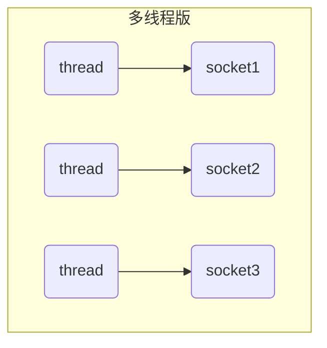
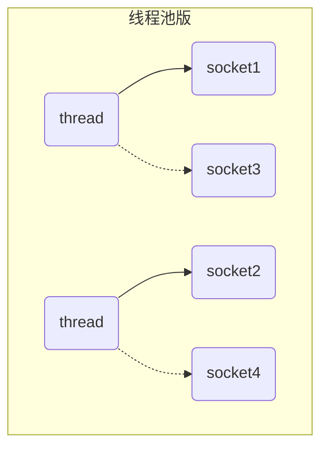
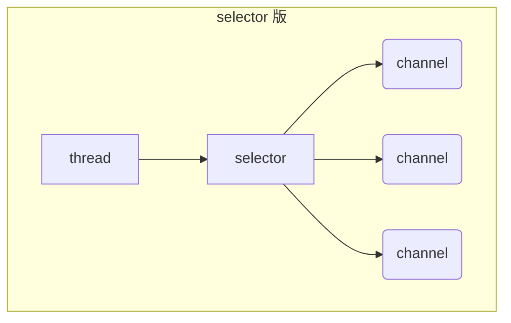
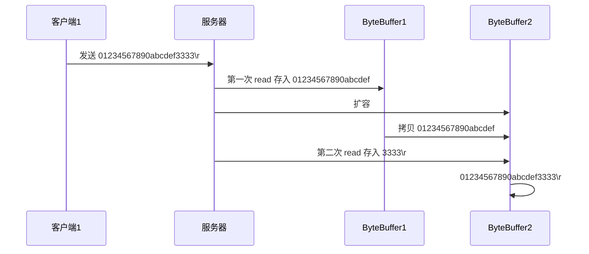

# 一. NIO 基础

Java NIO系统的**核心**在于：**通道(Channel)和缓冲区(Buffer)**。通道表示打开到 IO 设备(例如：文件、套接字)的连接。若需要使用 NIO 系统，需要获取用于**连接 IO 设备的通道**以及用于**容纳数据的缓冲区**。然后操作缓冲区，对数据进行处理

简而言之，**通道负责传输，缓冲区负责存储**

## 1. 三大组件

### 1.1 Channel & Buffer

channel 有一点类似于 stream，它就是读写数据的**双向通道**，可以从 channel 将数据读入 buffer，也可以将 buffer 的数据写入 channel，而之前的 stream 要么是输入，要么是输出，channel 比 stream 更为底层


**常见的Channel有以下四种**，其中FileChannel主要用于文件传输，其余三种用于网络通信

* FileChannel：文件数据传输通道
* DatagramChannel：UDP的数据传输通道
* SocketChannel：TCP的数据传输通道（客户端、服务器端都能用）
* ServerSocketChannel：TCP的数据传输通道（服务器端专用）


buffer 则用来缓冲读写数据，常见的 buffer 有

* ByteBuffer
  * MappedByteBuffer
  * DirectByteBuffer
  * HeapByteBuffer
* ShortBuffer
* IntBuffer
* LongBuffer
* FloatBuffer
* DoubleBuffer
* CharBuffer


### 1.2 Selector

selector 单从字面意思不好理解，需要结合服务器的设计演化来理解它的用途

在使用Selector之前，处理socket连接还有以下两种方法

#### 多线程版设计

为每个连接分别开辟一个线程，分别去处理对应的socke连接


##### ⚠️ 多线程版缺点

* **内存占用高**： 每个线程都需要占用一定的内存，当连接较多时，会开辟大量线程，导致占用大量内存
* **线程上下文切换成本高**
* **只适合连接数少的场景**：连接数过多，会导致创建很多线程，从而出现问题

#### 线程池版设计

使用线程池，让线程池中的线程去处理连接


##### ⚠️ 线程池版缺点

* 阻塞模式下，线程仅能处理一个 socket 连接
  * 线程池中的线程获取任务（task）后，**只有当其执行完任务之后（断开连接后），才会去获取并执行下一个任务**
  * 若socke连接一直未断开，则其对应的线程无法处理其他socke连接

* 仅适合**短连接**场景
  * 短连接即建立连接发送请求并响应后就立即断开，使得线程池中的线程可以快速处理其他连接


#### selector 版设计

selector 的作用就是配合一个线程来管理多个 channel**（fileChannel因为是阻塞式的，所以无法使用selector）**，selector获取这些 channel 上发生的事件，这些 channel 工作在非阻塞模式下，不会让线程吊死在一个 channel 上。适合连接数特别多，但流量低的场景（low traffic）



若事件未就绪，调用 selector 的 select() 会阻塞直到 channel 发生了读写就绪事件；这些事件发生时，select 方法就会返回这些事件并交给 thread 来处理

## 2. ByteBuffer

再项目根目录有一普通文本文件 data.txt，内容为

```
1234567890abcd
```

使用 FileChannel 来读取文件内容

```java
@Slf4j
public class ChannelDemo1 {
    public static void main(String[] args) {
        // try (FileChannel channel = new FileInputStream("data.txt").getChannel()) {
        try (RandomAccessFile file = new RandomAccessFile("data.txt", "rw")) {
            FileChannel channel = file.getChannel();
            ByteBuffer buffer = ByteBuffer.allocate(10);
            do {
                // 向 buffer 写入
                int len = channel.read(buffer);
                log.debug("读到字节数：{}", len);
                if (len == -1) {
                    break;
                }
                // 切换 buffer 读模式
                buffer.flip();
                while(buffer.hasRemaining()) {
                    log.debug("{}", (char)buffer.get());
                }
                // 切换 buffer 写模式
                buffer.clear();
            } while (true);
        } catch (IOException e) {
            e.printStackTrace();
        }
    }
}
```

输出

```bash
10:39:03 [DEBUG] [main] c.i.n.ChannelDemo1 - 读到字节数：10
10:39:03 [DEBUG] [main] c.i.n.ChannelDemo1 - 1
10:39:03 [DEBUG] [main] c.i.n.ChannelDemo1 - 2
10:39:03 [DEBUG] [main] c.i.n.ChannelDemo1 - 3
10:39:03 [DEBUG] [main] c.i.n.ChannelDemo1 - 4
10:39:03 [DEBUG] [main] c.i.n.ChannelDemo1 - 5
10:39:03 [DEBUG] [main] c.i.n.ChannelDemo1 - 6
10:39:03 [DEBUG] [main] c.i.n.ChannelDemo1 - 7
10:39:03 [DEBUG] [main] c.i.n.ChannelDemo1 - 8
10:39:03 [DEBUG] [main] c.i.n.ChannelDemo1 - 9
10:39:03 [DEBUG] [main] c.i.n.ChannelDemo1 - 0
10:39:03 [DEBUG] [main] c.i.n.ChannelDemo1 - 读到字节数：4
10:39:03 [DEBUG] [main] c.i.n.ChannelDemo1 - a
10:39:03 [DEBUG] [main] c.i.n.ChannelDemo1 - b
10:39:03 [DEBUG] [main] c.i.n.ChannelDemo1 - c
10:39:03 [DEBUG] [main] c.i.n.ChannelDemo1 - d
10:39:03 [DEBUG] [main] c.i.n.ChannelDemo1 - 读到字节数：-1
```

### 2.1  ByteBuffer 正确使用姿势

1. 向 buffer 写入数据，例如调用 channel.read(buffer)
2. 调用 flip() 切换至**读模式**
3. 从 buffer 读取数据，例如调用 buffer.get()
4. 调用 clear() 或 compact() 切换至**写模式**
5. 重复 1~4 步骤

### 2.2 ByteBuffer 结构

ByteBuffer 有以下重要属性

* capacity：缓冲区容量
* position：当前操作的索引
* limit：能`读取/写入`的最大索引

一开始时，position指向0，capacity和limit都指向容量的最大索引


写模式下，position 是写入位置，limit 等于容量，下图表示写入了 4 个字节后的状态


flip 动作（切换到写模式）发生后，position 切换为读取位置，limit 切换为读取限制


读取 4 个字节后，状态


clear 动作发生后，状态


compact 方法，是把未读完的部分向前压缩，然后切换至写模式

> 原`c、d`从索引为`2、3`复制到了`0、1`，但执行完后索引为`2、3`的`c、d`并未清除，只不过切换到写模式后，会将position指向`2`，此时再写入就会覆盖未清除的`c、d`；即便不写入，再切换到读模式也可以通过`limit`防止读取到未清除的数据


#### 💡 调试工具类

```java
import io.netty.util.internal.StringUtil;

import java.nio.ByteBuffer;

import static io.netty.util.internal.MathUtil.isOutOfBounds;
import static io.netty.util.internal.StringUtil.NEWLINE;

public class ByteBufferUtil {
    private static final char[] BYTE2CHAR = new char[256];
    private static final char[] HEXDUMP_TABLE = new char[256 * 4];
    private static final String[] HEXPADDING = new String[16];
    private static final String[] HEXDUMP_ROWPREFIXES = new String[65536 >>> 4];
    private static final String[] BYTE2HEX = new String[256];
    private static final String[] BYTEPADDING = new String[16];

    static {
        final char[] DIGITS = "0123456789abcdef".toCharArray();
        for (int i = 0; i < 256; i++) {
            HEXDUMP_TABLE[i << 1] = DIGITS[i >>> 4 & 0x0F];
            HEXDUMP_TABLE[(i << 1) + 1] = DIGITS[i & 0x0F];
        }

        int i;

        // Generate the lookup table for hex dump paddings
        for (i = 0; i < HEXPADDING.length; i++) {
            int padding = HEXPADDING.length - i;
            StringBuilder buf = new StringBuilder(padding * 3);
            for (int j = 0; j < padding; j++) {
                buf.append("   ");
            }
            HEXPADDING[i] = buf.toString();
        }

        // Generate the lookup table for the start-offset header in each row (up to 64KiB).
        for (i = 0; i < HEXDUMP_ROWPREFIXES.length; i++) {
            StringBuilder buf = new StringBuilder(12);
            buf.append(NEWLINE);
            buf.append(Long.toHexString(i << 4 & 0xFFFFFFFFL | 0x100000000L));
            buf.setCharAt(buf.length() - 9, '|');
            buf.append('|');
            HEXDUMP_ROWPREFIXES[i] = buf.toString();
        }

        // Generate the lookup table for byte-to-hex-dump conversion
        for (i = 0; i < BYTE2HEX.length; i++) {
            BYTE2HEX[i] = ' ' + StringUtil.byteToHexStringPadded(i);
        }

        // Generate the lookup table for byte dump paddings
        for (i = 0; i < BYTEPADDING.length; i++) {
            int padding = BYTEPADDING.length - i;
            StringBuilder buf = new StringBuilder(padding);
            for (int j = 0; j < padding; j++) {
                buf.append(' ');
            }
            BYTEPADDING[i] = buf.toString();
        }

        // Generate the lookup table for byte-to-char conversion
        for (i = 0; i < BYTE2CHAR.length; i++) {
            if (i <= 0x1f || i >= 0x7f) {
                BYTE2CHAR[i] = '.';
            } else {
                BYTE2CHAR[i] = (char) i;
            }
        }
    }

    /**
     * 打印所有内容
     * @param buffer
     */
    public static void debugAll(ByteBuffer buffer) {
        int oldlimit = buffer.limit();
        buffer.limit(buffer.capacity());
        StringBuilder origin = new StringBuilder(256);
        appendPrettyHexDump(origin, buffer, 0, buffer.capacity());
        System.out.println("+--------+-------------------- all ------------------------+----------------+");
        System.out.printf("position: [%d], limit: [%d]\n", buffer.position(), oldlimit);
        System.out.println(origin);
        buffer.limit(oldlimit);
    }

    /**
     * 打印可读取内容
     * @param buffer
     */
    public static void debugRead(ByteBuffer buffer) {
        StringBuilder builder = new StringBuilder(256);
        appendPrettyHexDump(builder, buffer, buffer.position(), buffer.limit() - buffer.position());
        System.out.println("+--------+-------------------- read -----------------------+----------------+");
        System.out.printf("position: [%d], limit: [%d]\n", buffer.position(), buffer.limit());
        System.out.println(builder);
    }

    private static void appendPrettyHexDump(StringBuilder dump, ByteBuffer buf, int offset, int length) {
        if (isOutOfBounds(offset, length, buf.capacity())) {
            throw new IndexOutOfBoundsException(
                    "expected: " + "0 <= offset(" + offset + ") <= offset + length(" + length
                            + ") <= " + "buf.capacity(" + buf.capacity() + ')');
        }
        if (length == 0) {
            return;
        }
        dump.append(
                "         +-------------------------------------------------+" +
                        NEWLINE + "         |  0  1  2  3  4  5  6  7  8  9  a  b  c  d  e  f |" +
                        NEWLINE + "+--------+-------------------------------------------------+----------------+");

        final int startIndex = offset;
        final int fullRows = length >>> 4;
        final int remainder = length & 0xF;

        // Dump the rows which have 16 bytes.
        for (int row = 0; row < fullRows; row++) {
            int rowStartIndex = (row << 4) + startIndex;

            // Per-row prefix.
            appendHexDumpRowPrefix(dump, row, rowStartIndex);

            // Hex dump
            int rowEndIndex = rowStartIndex + 16;
            for (int j = rowStartIndex; j < rowEndIndex; j++) {
                dump.append(BYTE2HEX[getUnsignedByte(buf, j)]);
            }
            dump.append(" |");

            // ASCII dump
            for (int j = rowStartIndex; j < rowEndIndex; j++) {
                dump.append(BYTE2CHAR[getUnsignedByte(buf, j)]);
            }
            dump.append('|');
        }

        // Dump the last row which has less than 16 bytes.
        if (remainder != 0) {
            int rowStartIndex = (fullRows << 4) + startIndex;
            appendHexDumpRowPrefix(dump, fullRows, rowStartIndex);

            // Hex dump
            int rowEndIndex = rowStartIndex + remainder;
            for (int j = rowStartIndex; j < rowEndIndex; j++) {
                dump.append(BYTE2HEX[getUnsignedByte(buf, j)]);
            }
            dump.append(HEXPADDING[remainder]);
            dump.append(" |");

            // Ascii dump
            for (int j = rowStartIndex; j < rowEndIndex; j++) {
                dump.append(BYTE2CHAR[getUnsignedByte(buf, j)]);
            }
            dump.append(BYTEPADDING[remainder]);
            dump.append('|');
        }

        dump.append(NEWLINE +
                "+--------+-------------------------------------------------+----------------+");
    }

    private static void appendHexDumpRowPrefix(StringBuilder dump, int row, int rowStartIndex) {
        if (row < HEXDUMP_ROWPREFIXES.length) {
            dump.append(HEXDUMP_ROWPREFIXES[row]);
        } else {
            dump.append(NEWLINE);
            dump.append(Long.toHexString(rowStartIndex & 0xFFFFFFFFL | 0x100000000L));
            dump.setCharAt(dump.length() - 9, '|');
            dump.append('|');
        }
    }

    public static short getUnsignedByte(ByteBuffer buffer, int index) {
        return (short) (buffer.get(index) & 0xFF);
    }
}
```

测试

```java
public static void main(String[] args) {
    ByteBuffer buffer = ByteBuffer.allocate(10);
    buffer.put((byte) 0x61); // 'a'
    ByteBufferUtil.debugAll(buffer);
    buffer.put(new byte[]{0x62, 0x63, 0x64}); // b c d
    ByteBufferUtil.debugAll(buffer);
    // System.out.println(buffer.get());
    buffer.flip();
    System.out.println(buffer.get());
    ByteBufferUtil.debugAll(buffer);
    buffer.compact();
    ByteBufferUtil.debugAll(buffer);
    buffer.put(new byte[]{0x65, 0x6f});
    ByteBufferUtil.debugAll(buffer);
}
```

结果

```
+--------+-------------------- all ------------------------+----------------+
position: [1], limit: [10]
         +-------------------------------------------------+
         |  0  1  2  3  4  5  6  7  8  9  a  b  c  d  e  f |
+--------+-------------------------------------------------+----------------+
|00000000| 61 00 00 00 00 00 00 00 00 00                   |a.........      |
+--------+-------------------------------------------------+----------------+
+--------+-------------------- all ------------------------+----------------+
position: [4], limit: [10]
         +-------------------------------------------------+
         |  0  1  2  3  4  5  6  7  8  9  a  b  c  d  e  f |
+--------+-------------------------------------------------+----------------+
|00000000| 61 62 63 64 00 00 00 00 00 00                   |abcd......      |
+--------+-------------------------------------------------+----------------+
97
+--------+-------------------- all ------------------------+----------------+
position: [1], limit: [4]
         +-------------------------------------------------+
         |  0  1  2  3  4  5  6  7  8  9  a  b  c  d  e  f |
+--------+-------------------------------------------------+----------------+
|00000000| 61 62 63 64 00 00 00 00 00 00                   |abcd......      |
+--------+-------------------------------------------------+----------------+
+--------+-------------------- all ------------------------+----------------+
position: [3], limit: [10]
         +-------------------------------------------------+
         |  0  1  2  3  4  5  6  7  8  9  a  b  c  d  e  f |
+--------+-------------------------------------------------+----------------+
|00000000| 62 63 64 64 00 00 00 00 00 00                   |bcdd......      |
+--------+-------------------------------------------------+----------------+
+--------+-------------------- all ------------------------+----------------+
position: [5], limit: [10]
         +-------------------------------------------------+
         |  0  1  2  3  4  5  6  7  8  9  a  b  c  d  e  f |
+--------+-------------------------------------------------+----------------+
|00000000| 62 63 64 65 6f 00 00 00 00 00                   |bcdeo.....      |
+--------+-------------------------------------------------+----------------+
```

### 2.3 ByteBuffer 常见方法

#### 分配空间

可以使用 allocate 方法为 ByteBuffer 分配空间，其它 buffer 类也有该方法

```java
Bytebuffer buf = ByteBuffer.allocate(16);
```

#### 向 buffer 写入数据

有两种办法

* 调用 channel 的 read 方法
* 调用 buffer 自己的 put 方法

```java
int readBytes = channel.read(buf);
```

和

```java
buf.put((byte)127);
```

#### 从 buffer 读取数据

同样有两种办法

* 调用 channel 的 write 方法
* 调用 buffer 自己的 get 方法

```java
int writeBytes = channel.write(buf);
```

和

```java
byte b = buf.get();
```

get 方法会让 position 读指针向后走，如果想重复读取数据

* 可以调用 `rewind` 方法将 position 重新置为 0；还可以调用`mark`方法做一个标记，再调用`reset`方法重置到标记的位置
* 或者调用 `get(int i)` 方法获取索引 i 的内容，它不会移动读指针

#### mark 和 reset

mark 是在读取时，做一个标记，即使 position 改变，只要调用 reset 就能回到 mark 的位置

> **注意**
>
> rewind 和 flip 都会清除 mark 位置

```java
ByteBuffer buffer = ByteBuffer.allocate(10);
buffer.put(new byte[]{'a', 'b', 'C', 'd'});
// 切换到读模式
buffer.flip();
// rewind从头开始读
buffer.get(new byte[4]);
buffer.rewind(); // 将position重置为0
System.out.println((char) buffer.get());
buffer.rewind();

// mark & reset
// mark做-一个标记，记录position位置，reset 是将position重置到mark的位置
// 最开始position为0
System.out.println((char) buffer.get()); // 执行后position为1
System.out.println((char) buffer.get()); // 执行后position为2
buffer.mark(); // 加标记，索引2的位置
System.out.println((char) buffer.get());
System.out.println((char) buffer.get());
buffer.reset(); // 将position重置到索引2
System.out.println((char) buffer.get());
System.out.println((char) buffer.get());

// 读取指定索引的byte，不会移动position
System.out.println((char) buffer.get(1));
System.out.println((char) buffer.get(2));
```


#### 字符串与 ByteBuffer 互转

```java
// 1.字符串转为ByteBuffer（不会自动切换到读模式，需要手动切换到读模式再进行读操作）
ByteBuffer buffer1 = ByteBuffer.allocate(16);
buffer1.put("hello".getBytes());
debugAll(buffer1);

// 2. Charset（会自动切换到读模式）
ByteBuffer buffer2 = StandardCharsets.UTF_8.encode("hello");
debugAll(buffer2);

// 3.wrap（会自动切换到读模式）
ByteBuffer buffer3 = ByteBuffer.wrap("hello".getBytes());
debugAll(buffer3);

// 注意要在读模式下读取
buffer1.flip();
String str1 = StandardCharsets.UTF_8.decode(buffer1).toString();
System.out.println(str1);

// 注意要在读模式下读取
String str2 = StandardCharsets.UTF_8.decode(buffer2).toString();
System.out.println(str2);
```

输出

```
+--------+-------------------- all ------------------------+----------------+
position: [5], limit: [16]
         +-------------------------------------------------+
         |  0  1  2  3  4  5  6  7  8  9  a  b  c  d  e  f |
+--------+-------------------------------------------------+----------------+
|00000000| 68 65 6c 6c 6f 00 00 00 00 00 00 00 00 00 00 00 |hello...........|
+--------+-------------------------------------------------+----------------+
+--------+-------------------- all ------------------------+----------------+
position: [0], limit: [5]
         +-------------------------------------------------+
         |  0  1  2  3  4  5  6  7  8  9  a  b  c  d  e  f |
+--------+-------------------------------------------------+----------------+
|00000000| 68 65 6c 6c 6f                                  |hello           |
+--------+-------------------------------------------------+----------------+
+--------+-------------------- all ------------------------+----------------+
position: [0], limit: [5]
         +-------------------------------------------------+
         |  0  1  2  3  4  5  6  7  8  9  a  b  c  d  e  f |
+--------+-------------------------------------------------+----------------+
|00000000| 68 65 6c 6c 6f                                  |hello           |
+--------+-------------------------------------------------+----------------+
hello
hello
```


#### ⚠️ Buffer 的线程安全

> Buffer 是**非线程安全的**

### 2.4 Scattering Reads 分散读取

分散读取（Scattering Reads），在项目根目录有一个文件data2.txt，其内容为

```
onetwothree
```

使用如下方式读取，可以将数据填充至多个 buffer

```java
try (RandomAccessFile file = new RandomAccessFile("data2.txt", "rw")) {
    FileChannel channel = file.getChannel();
    ByteBuffer a = ByteBuffer.allocate(3);
    ByteBuffer b = ByteBuffer.allocate(3);
    ByteBuffer c = ByteBuffer.allocate(5);
    channel.read(new ByteBuffer[]{a, b, c});
    a.flip();
    b.flip();
    c.flip();
    debugAll(a);
    debugAll(b);
    debugAll(c);
} catch (IOException e) {
    e.printStackTrace();
}
```

结果

```
+--------+-------------------- all ------------------------+----------------+
position: [0], limit: [3]
         +-------------------------------------------------+
         |  0  1  2  3  4  5  6  7  8  9  a  b  c  d  e  f |
+--------+-------------------------------------------------+----------------+
|00000000| 6f 6e 65                                        |one             |
+--------+-------------------------------------------------+----------------+
+--------+-------------------- all ------------------------+----------------+
position: [0], limit: [3]
         +-------------------------------------------------+
         |  0  1  2  3  4  5  6  7  8  9  a  b  c  d  e  f |
+--------+-------------------------------------------------+----------------+
|00000000| 74 77 6f                                        |two             |
+--------+-------------------------------------------------+----------------+
+--------+-------------------- all ------------------------+----------------+
position: [0], limit: [5]
         +-------------------------------------------------+
         |  0  1  2  3  4  5  6  7  8  9  a  b  c  d  e  f |
+--------+-------------------------------------------------+----------------+
|00000000| 74 68 72 65 65                                  |three           |
+--------+-------------------------------------------------+----------------+
```

### 2.5 Gathering Writes 集中写入

使用如下方式写入，可以将多个 buffer 的数据填充至 channel

```java
public static void main(String[] args) {
    try (RandomAccessFile file = new RandomAccessFile("data2.txt", "rw")) {
        FileChannel channel = file.getChannel();
        ByteBuffer d = ByteBuffer.allocate(4);
        ByteBuffer e = ByteBuffer.allocate(4);
        channel.position(11);

        d.put(new byte[]{'f', 'o', 'u', 'r'});
        e.put(new byte[]{'f', 'i', 'v', 'e'});
        d.flip();
        e.flip();
        debugAll(d);
        debugAll(e);
        channel.write(new ByteBuffer[]{d, e});
    } catch (IOException e) {
        e.printStackTrace();
    }
}
```

输出

```
+--------+-------------------- all ------------------------+----------------+
position: [0], limit: [4]
         +-------------------------------------------------+
         |  0  1  2  3  4  5  6  7  8  9  a  b  c  d  e  f |
+--------+-------------------------------------------------+----------------+
|00000000| 66 6f 75 72                                     |four            |
+--------+-------------------------------------------------+----------------+
+--------+-------------------- all ------------------------+----------------+
position: [0], limit: [4]
         +-------------------------------------------------+
         |  0  1  2  3  4  5  6  7  8  9  a  b  c  d  e  f |
+--------+-------------------------------------------------+----------------+
|00000000| 66 69 76 65                                     |five            |
+--------+-------------------------------------------------+----------------+
```

文件内容

```
onetwothreefourfive
```

### 2.6 练习

网络上有多条数据发送给服务端，数据之间使用 \n 进行分隔
但由于某种原因这些数据在接收时，被进行了重新组合，例如原始数据有3条为

* Hello,world\n
* I'm zhangsan\n
* How are you?\n

变成了下面的两个 byteBuffer (黏包，半包)

* Hello,world\nI'm zhangsan\nHo
* w are you?\n

现在要求你编写程序，将错乱的数据恢复成原始的按 \n 分隔的数据


解法一：

```java
public static void main(String[] args) {
    ByteBuffer source = ByteBuffer.allocate(32);
    //                     11            24
    source.put("Hello,world\nI'm zhangsan\nHo".getBytes());
    split(source);

    source.put("w are you?\nhaha!\n".getBytes());
    split(source);
}

private static void split(ByteBuffer source) {
    source.flip();
    for (int i = 0; i < source.limit(); i++) {
        if (source.get(i) == '\n') {
            System.out.println(i);
            int length = i + 1 - source.position();
            ByteBuffer target = ByteBuffer.allocate(length);
            for (int j = 0; j < length; j++) {
                target.put(source.get());
            }
            debugAll(target);
        }
    }
    source.compact();
}
```

输出：

```
+--------+-------------------- all ------------------------+----------------+
position: [12], limit: [12]
         +-------------------------------------------------+
         |  0  1  2  3  4  5  6  7  8  9  a  b  c  d  e  f |
+--------+-------------------------------------------------+----------------+
|00000000| 48 65 6c 6c 6f 2c 77 6f 72 6c 64 0a             |Hello,world.    |
+--------+-------------------------------------------------+----------------+
24
+--------+-------------------- all ------------------------+----------------+
position: [13], limit: [13]
         +-------------------------------------------------+
         |  0  1  2  3  4  5  6  7  8  9  a  b  c  d  e  f |
+--------+-------------------------------------------------+----------------+
|00000000| 49 27 6d 20 7a 68 61 6e 67 73 61 6e 0a          |I'm zhangsan.   |
+--------+-------------------------------------------------+----------------+
12
+--------+-------------------- all ------------------------+----------------+
position: [13], limit: [13]
         +-------------------------------------------------+
         |  0  1  2  3  4  5  6  7  8  9  a  b  c  d  e  f |
+--------+-------------------------------------------------+----------------+
|00000000| 48 6f 77 20 61 72 65 20 79 6f 75 3f 0a          |How are you?.   |
+--------+-------------------------------------------------+----------------+
18
+--------+-------------------- all ------------------------+----------------+
position: [6], limit: [6]
         +-------------------------------------------------+
         |  0  1  2  3  4  5  6  7  8  9  a  b  c  d  e  f |
+--------+-------------------------------------------------+----------------+
|00000000| 68 61 68 61 21 0a                               |haha!.          |
+--------+-------------------------------------------------+----------------+
```

解法二：

```java
public static void main(String[] args) {
    ByteBuffer source = ByteBuffer.allocate(32);
    //                     11            24
    source.put("Hello,world\nI'm zhangsan\nHo".getBytes());
    split(source);

    source.put("w are you?\nhaha!\n".getBytes());
    split(source);
}

private static void split(ByteBuffer source) {
    source.flip();
    int oldLimit = source.limit();
    for (int i = 0; i < oldLimit; i++) {
        if (source.get(i) == '\n') {
            System.out.println(i);
            ByteBuffer target = ByteBuffer.allocate(i + 1 - source.position());
            // 0 ~ limit
            source.limit(i + 1);
            target.put(source); // 从source 读，向 target 写
            debugAll(target);
            source.limit(oldLimit);
        }
    }
    source.compact();
}
```

## 3. 文件编程

### 3.1 FileChannel

#### ⚠️ FileChannel 工作模式

> FileChannel 只能工作在阻塞模式下（不能使用selector）

#### 获取

不能直接打开 FileChannel，必须通过 FileInputStream、FileOutputStream 或者 RandomAccessFile 来获取 FileChannel，它们都有 getChannel 方法

* 通过 FileInputStream 获取的 channel 只能读
* 通过 FileOutputStream 获取的 channel 只能写
* 通过 RandomAccessFile 是否能读写根据构造 RandomAccessFile 时的读写模式（`rw`）决定

#### 读取

会从 channel 读取数据填充 ByteBuffer，返回值表示读到了多少字节，-1 表示到达了文件的末尾

```java
int readBytes = channel.read(buffer);
```

#### 写入

写入的正确姿势如下（ SocketChannel有写能力的限制）

```java
ByteBuffer buffer = ...;
buffer.put(...); // 存入数据
buffer.flip();   // 切换读模式
// 如果buffer还有剩余
while(buffer.hasRemaining()) {
    channel.write(buffer);
}
```

在 while 中调用 channel.write 是因为 write 方法并不能保证一次将 buffer 中的内容全部写入 channel

#### 关闭

channel 必须关闭，不过调用了 FileInputStream、FileOutputStream 或者 RandomAccessFile 的 close 方法会间接地调用 channel 的 close 方法（推荐使用`try with resource`方式，会自动帮我们在`finally`代码块里关闭资源）

#### 位置

获取当前位置

```java
long pos = channel.position();
```

设置当前位置

```java
long newPos = ...;
channel.position(newPos);
```

设置当前位置时，如果设置为文件的末尾

* 这时读取会返回 -1 
* 这时写入，会追加内容，但要注意如果 position 超过了文件末尾，再写入时在新内容和原末尾之间会有空洞（00）

#### 大小

使用 size 方法获取文件的大小

#### 强制写入

操作系统出于性能的考虑，会将数据缓存，不是立刻写入磁盘。可以调用 force(true)  方法将文件内容和元数据（文件的权限等信息）立刻写入磁盘


### 3.2 两个 Channel 传输数据

> 注意：
>
> 单次传输，只能传输2GB的文件

```java
long start = System.nanoTime();
try (FileChannel from = new FileInputStream("from.txt").getChannel();
     FileChannel to = new FileOutputStream("to.txt").getChannel();
) {
    // 效率高，低层会利用操作系统的零拷贝进行优化
    from.transferTo(0, from.size(), to);
} catch (IOException e) {
    e.printStackTrace();
}
long end = System.nanoTime();
System.out.println("transferTo 用时：" + (end - start) / 1000_000.0);
```

输出

```
transferTo 用时：9.080201
```


超过 2g 大小的文件传输：

```java
public class TestFileChannelTransferTo {
    public static void main(String[] args) {
        try (
                FileChannel from = new FileInputStream("from.txt").getChannel();
                FileChannel to = new FileOutputStream("to.txt").getChannel();
        ) {
            // 效率高，底层会利用操作系统的零拷贝进行优化
            long size = from.size();
            // left 变量代表还剩余多少字节
            for (long left = size; left > 0; ) {
                System.out.println("position:" + (size - left) + " left:" + left);
                // left 减 实际传输的字节数
                left -= from.transferTo((size - left), left, to);
            }
        } catch (IOException e) {
            e.printStackTrace();
        }
    }
}
```

实际传输一个超大文件

```
position:0 left:7769948160
position:2147483647 left:5622464513
position:4294967294 left:3474980866
position:6442450941 left:1327497219
```


### 3.3 Path

jdk7 引入了 Path 和 Paths 类

* Path 用来表示文件路径
* Paths 是工具类，用来获取 Path 实例

```java
Path source = Paths.get("1.txt"); // 相对路径 使用 user.dir 环境变量来定位 1.txt

Path source = Paths.get("d:\\1.txt"); // 绝对路径 代表了  d:\1.txt

Path source = Paths.get("d:/1.txt"); // 绝对路径 同样代表了  d:\1.txt

Path projects = Paths.get("d:\\data", "projects"); // 代表了  d:\data\projects
```

* `.` 代表了当前路径
* `..` 代表了上一级路径

例如目录结构如下

```
d:
	|- data
		|- projects
			|- a
			|- b
```

代码

```java
Path path = Paths.get("d:\\data\\projects\\a\\..\\b");
System.out.println(path);
System.out.println(path.normalize()); // 正常化路径
```

会输出

```
d:\data\projects\a\..\b
d:\data\projects\b
```


### 3.4 Files

jdk1.7新增

检查文件是否存在

```java
Path path = Paths.get("helloword/data.txt");
System.out.println(Files.exists(path));
```


创建一级目录

```java
Path path = Paths.get("helloword/d1");
Files.createDirectory(path);
```

* 如果目录已存在，会抛异常 FileAlreadyExistsException
* 不能一次创建多级目录，否则会抛异常 NoSuchFileException


创建多级目录用`createDirectories`方法

```java
Path path = Paths.get("helloword/d1/d2");
Files.createDirectories(path);
```


 拷贝文件

```java
Path source = Paths.get("helloword/data.txt");
Path target = Paths.get("helloword/target.txt");
// 效率高
Files.copy(source, target);
```

* 如果文件已存在，会抛异常 FileAlreadyExistsException

如果希望用 source 覆盖掉 target，需要用 StandardCopyOption 来控制

```java
Files.copy(source, target, StandardCopyOption.REPLACE_EXISTING);
```


移动文件

```java
Path source = Paths.get("helloword/data.txt");
Path target = Paths.get("helloword/data.txt");

Files.move(source, target, StandardCopyOption.ATOMIC_MOVE);
```

* StandardCopyOption.ATOMIC_MOVE 保证文件移动的原子性


删除文件

```java
Path target = Paths.get("helloword/target.txt");

Files.delete(target);
```

* 如果文件不存在，会抛异常 NoSuchFileException


删除目录

```java
Path target = Paths.get("helloword/d1");

Files.delete(target);
```

* 如果目录还有内容，会抛异常 DirectoryNotEmptyException


遍历目录文件

```java
public static void main(String[] args) throws IOException {

    // 匿名内部类想使用外部变量，则该外部变量的地址不能改变; 可以将基本数据类型声明为final但这样就不能改变这个变量的值，为了解决这个问题可以使用Atomicxxx
    // 统计文件夹的数量
    AtomicInteger dirCount = new AtomicInteger();
    // 统计文件的数量
    AtomicInteger fileCount = new AtomicInteger();
    // 访问者模式
    // 第一个参数是从哪个目录开始遍历，第二个参数是遍历的操作
    Files.walkFileTree(Paths.get("D:\\bilibili"), new SimpleFileVisitor<Path>() {
        // 访问文件夹之前被调用
        @Override
        public FileVisitResult preVisitDirectory(Path dir, BasicFileAttributes attrs) throws IOException {
            System.out.println("dir ==> " + dir);
            // 文件夹的数量+1
            dirCount.incrementAndGet();
            // 不要改变返回的结果
            return super.preVisitDirectory(dir, attrs);
        }

        // 访问这个文件的操作
        @Override
        public FileVisitResult visitFile(Path file, BasicFileAttributes attrs) throws IOException {
            System.out.println("file ==> " + file);
            // 文件的数量+1
            fileCount.incrementAndGet();
            // 不要改变返回的结果
            return super.visitFile(file, attrs);
        }

        // 访问这个文件失败时的操作
        @Override
        public FileVisitResult visitFileFailed(Path file, IOException exc) throws IOException {
            return super.visitFileFailed(file, exc);
        }

        // 访问文件夹之后被调用
        @Override
        public FileVisitResult postVisitDirectory(Path dir, IOException exc) throws IOException {
            return super.postVisitDirectory(dir, exc);
        }
    });
	// 文件夹的个数比windows系统查看的文件夹个数少一个，这是因为windows系统查询的文件夹个数没有包含起始位置（即 D:\\bilibili），而代码里包含了起始位置
    System.out.println(dirCount);
    // 文件的个数和windows系统查看的文件个数一样
    System.out.println(fileCount);
}
```

输出：根据输出可以看到其实就是dfs，深度优先搜索 遍历文件和文件夹

```
进入文件夹 ==> D:\笔记
进入文件夹 ==> D:\笔记\Docker
进入文件夹 ==> D:\笔记\Docker\image
file ==> D:\笔记\Docker\image\image-20221129164638332.png
file ==> D:\笔记\Docker\image\image-20221129164653506.png
file ==> D:\笔记\Docker\image\image-20221129164836316.png
file ==> D:\笔记\Docker\image\image-20221129164934719.png
file ==> D:\笔记\Docker\image\image-20221129165623617.png
file ==> D:\笔记\Docker\image\image-20221129173128593.png
离开文件夹 <== D:\笔记\Docker\image
file ==> D:\笔记\Docker\README.md
离开文件夹 <== D:\笔记\Docker
进入文件夹 ==> D:\笔记\docker部署
进入文件夹 ==> D:\笔记\docker部署\image
file ==> D:\笔记\docker部署\image\image-20221130113702649.png
file ==> D:\笔记\docker部署\image\image-20221130113744943.png
file ==> D:\笔记\docker部署\image\image-20221130141853388.png
file ==> D:\笔记\docker部署\image\image-20221130141931075.png
file ==> D:\笔记\docker部署\image\image-20221130143341635.png
file ==> D:\笔记\docker部署\image\image-20221130143535732.png
file ==> D:\笔记\docker部署\image\image-20221130150326899.png
file ==> D:\笔记\docker部署\image\image-20221215161858131.png
离开文件夹 <== D:\笔记\docker部署\image
file ==> D:\笔记\docker部署\README.md
离开文件夹 <== D:\笔记\docker部署
......省略部分输出
31
442
```


统计 jar 的数目

```java
Path path = Paths.get("C:\\Program Files\\Java\\jdk1.8.0_91");
// 统计jar文件的数量
AtomicInteger fileCount = new AtomicInteger();
// 第一个参数是从哪个目录开始遍历，第二个参数是遍历的操作
Files.walkFileTree(path, new SimpleFileVisitor<Path>(){
    @Override
    public FileVisitResult visitFile(Path file, BasicFileAttributes attrs) 
        throws IOException {
        if (file.toFile().getName().endsWith(".jar")) {
            fileCount.incrementAndGet();
        }
        return super.visitFile(file, attrs);
    }
});
System.out.println(fileCount); // 724
```

删除多级目录

根据删除文件规则，当该文件夹里面没有文件夹或文件后才能删除，因此当我们访问的是文件时直接删除文件，再访问文件夹后执行删除文件夹操作（由于使用的是dfs，因此里面的文件夹和文件都已经被删除了）

```java
Path path = Paths.get("d:\\a");
Files.walkFileTree(path, new SimpleFileVisitor<Path>(){
    @Override
    public FileVisitResult visitFile(Path file, BasicFileAttributes attrs) 
        throws IOException {
        Files.delete(file);
        return super.visitFile(file, attrs);
    }

    @Override
    public FileVisitResult postVisitDirectory(Path dir, IOException exc) 
        throws IOException {
        Files.delete(dir);
        return super.postVisitDirectory(dir, exc);
    }
});
```


#### ⚠️ 删除很危险

> 删除是危险操作，确保要递归删除的文件夹没有重要内容


拷贝多级目录

```java
long start = System.currentTimeMillis();
String source = "D:\\Snipaste-1.16.2-x64";
String target = "D:\\Snipaste-1.16.2-x64aaa";

Files.walk(Paths.get(source)).forEach(path -> {
    try {
        String targetName = path.toString().replace(source, target);
        // 是目录
        if (Files.isDirectory(path)) {
            Files.createDirectory(Paths.get(targetName));
        }
        // 是普通文件
        else if (Files.isRegularFile(path)) {
            Files.copy(path, Paths.get(targetName));
        }
    } catch (IOException e) {
        e.printStackTrace();
    }
});
long end = System.currentTimeMillis();
System.out.println(end - start);
```

## 4. 网络编程

### 4.1 非阻塞 vs 阻塞

#### 阻塞

* 阻塞模式下，相关方法都会导致线程暂停
  * ServerSocketChannel.accept 会在没有连接建立时让线程暂停
  * SocketChannel.read 会在没有数据可读时让线程暂停
  * 阻塞的表现其实就是线程暂停了，暂停期间不会占用 cpu，但线程相当于闲置
* 单线程下，阻塞方法之间相互影响，几乎不能正常工作，需要多线程支持
* 但多线程下，有新的问题，体现在以下方面
  * 32 位 jvm 一个线程 320k，64 位 jvm 一个线程 1024k，如果连接数过多，必然导致 OOM，并且线程太多，反而会因为频繁上下文切换导致性能降低
  * 可以采用线程池技术来减少线程数和线程上下文切换，但治标不治本，如果有很多连接建立，但长时间 inactive，会阻塞线程池中所有线程，因此不适合长连接，只适合短连接

服务器端

```java
import org.slf4j.Logger;
import org.slf4j.LoggerFactory;

import java.io.IOException;
import java.net.InetSocketAddress;
import java.nio.ByteBuffer;
import java.nio.channels.ServerSocketChannel;
import java.nio.channels.SocketChannel;
import java.util.ArrayList;
import java.util.List;

import static io.github.apzs.t1.a02_ByteBufferUtil.debugRead;

public class Server {
    // 日志
    private static final Logger logger = LoggerFactory.getLogger(Server.class);
    // 连接的所有客户端通道集合
    private static final List<SocketChannel> channels = new ArrayList<>();
    // 从通道中读取到的数据
    private static final ByteBuffer buffer = ByteBuffer.allocate(1024);

    public static void main(String[] args) throws IOException {
        // 创建服务器
        ServerSocketChannel ssc = ServerSocketChannel.open();
        // 绑定监听端口
        ssc.bind(new InetSocketAddress(8080));
        // 不让服务器停止，循环等待客户端连接和发送消息
        while (true) {
            // accept 建立与客户端连接， SocketChannel 用来与客户端之间通信
            logger.debug("connecting...");
            // 等待客户端连接
            // 该方法为阻塞方法；运行到这里时线程停止往下运行，直到有新的客户端建立连接
            SocketChannel sc = ssc.accept();
            logger.debug("connected ... " + sc);
            // 加入到连接集合
            channels.add(sc);
            // 遍历所有客户端，接收客户端发送的数据
            for (SocketChannel channel : channels) {
                // 接收客户端发送的数据
                logger.debug("before read ... " + channel);
                // 阻塞方法，运行到这里时线程停止往下运行，直到客户端发送了数据
                channel.read(buffer);
                buffer.flip();
                debugRead(buffer);
                buffer.clear();
                logger.debug("after read ... " + channel);
            }

        }
    }

}
```

客户端

```java
import org.slf4j.Logger;
import org.slf4j.LoggerFactory;

import java.io.IOException;
import java.net.InetSocketAddress;
import java.nio.channels.SocketChannel;
import java.nio.charset.Charset;

public class Client {

    private static final Logger logger = LoggerFactory.getLogger(Client.class);

    public static void main(String[] args) throws IOException {
        SocketChannel sc = SocketChannel.open();
        sc.connect(new InetSocketAddress("localhost", 8080));
        System.out.println("waiting...");
        sc.write(Charset.defaultCharset().encode("client!"));
        logger.debug(sc.toString());
    }
}
```

 * 当没有客户端与该服务器建立连接时，由于`ssc.accept()`是阻塞方法，因此运行服务器程序后会停到`ssc.accept()`这里，直到有客户端与该服务器建立连接
 * 当客户端与服务器建立连接后，服务器代码继续执行，由于`channel.read(buffer)`是阻塞方法，因此服务器程序会停到`channel.read(buffer)`这里，直到客户端发送消息
 * 当客户端发送消息后，服务器程序继续执行，由于只有一个客户端，因此channels遍历结束，进入到下一个while循环，此时继续阻塞到`ssc.accept()`这里，直到有新的客户端与该服务器建立连接
 * 当新的客户端与服务器建立连接后，服务器代码继续执行，由于`channel.read(buffer)`是阻塞方法，因此服务器程序会遍历第一个channel，此时阻塞到`channel.read(buffer)`这里，直到第一个客户端发送消息
 * 第一个客户端发送消息后，会遍历到第二个channel，然后阻塞到`channel.read(buffer)`这里，直到第二个客户端发送消息（当然第二个channel可以比第一个channel先发送消息，不过获取第一个客户端发送的消息后，才能获取到第二个客户端的消息;由于第二个客户端已经发送过消息了，因此不会阻塞【只有当前channel里没有数据才会阻塞】，进入到下一个while循环）
 * 第二个客户端发送消息后，channels遍历结束，进入到下一个while循环，此时继续阻塞到`ssc.accept()`这里，直到有新第三个客户端与该服务器建立连接
 * 当第三个的客户端与服务器建立连接后，再遍历所有channel，按顺序等待这些channel发送消息
 * ......
 * **可见这个阻塞方式的程序在单线程环境下几乎不能正常满足需求**

#### 非阻塞

* 非阻塞模式下，相关方法都会不会让线程暂停
  * 在 ServerSocketChannel.accept 在没有连接建立时，会返回 null，继续运行
  * SocketChannel.read 在没有数据可读时，会返回 0，但线程不必阻塞，可以去执行其它 SocketChannel 的 read 或是去执行 ServerSocketChannel.accept 
  * 写数据时，线程只是等待数据写入 Channel 即可，无需等 Channel 通过网络把数据发送出去
* 但非阻塞模式下，即使没有连接建立，和可读数据，线程仍然在不断运行，白白浪费了 cpu
* 数据复制过程中，线程实际还是阻塞的（AIO 改进的地方）

服务器端将ServerSocketChannel和SocketChannel都修改为非阻塞式，客户端代码不变，经过实验可以发现已经基本能够满足正常需求了

- 循环判断(有没有客户端建立连接、已连接的所有客户端有没有发送数据)，该程序基本能满足要求，但是过于浪费cpu资源

```java
public class Server {
    // 日志
    private static final Logger logger = LoggerFactory.getLogger(Server.class);
    // 连接的所有客户端通道集合
    private static final List<SocketChannel> channels = new ArrayList<>();
    // 从通道中读取到的数据
    private static final ByteBuffer buffer = ByteBuffer.allocate(1024);

    public static void main(String[] args) throws IOException {
        // 创建服务器
        ServerSocketChannel ssc = ServerSocketChannel.open();
        // 绑定监听端口
        ssc.bind(new InetSocketAddress(8080));
        logger.debug("已监听8080端口 ... ");
        ssc.configureBlocking(false);         //  <===  ServerSocketChannel修改为非阻塞式
        // 不让服务器停止，循环等待客户端连接和发送消息
        while (true) {
            // accept 建立与客户端连接， SocketChannel 用来与客户端之间通信
            // logger.debug("connecting...");
            // 等待客户端连接
            // 该方法为阻塞方法；运行到这里时线程停止往下运行，直到有新的客户端建立连接
            SocketChannel sc = ssc.accept();
            if (sc != null){
                logger.debug("connected ... " + sc);
                sc.configureBlocking(false);  //  <===  SocketChannel修改为非阻塞式
                // 加入到连接集合
                channels.add(sc);
            }
            // 遍历所有客户端，接收客户端发送的数据
            for (SocketChannel channel : channels) {
                // 接收客户端发送的数据
                int length = channel.read(buffer);
                if (length>0){
                    buffer.flip();
                    debugRead(buffer);
                    buffer.clear();
                    logger.debug("read ... " + channel);
                }

            }

        }
    }

}
```

#### 多路复用

单线程可以配合 Selector 完成对多个 Channel 可读写事件的监控，这称之为多路复用

* 多路复用仅针对网络 IO、普通文件 IO 没法利用多路复用
* 如果不用 Selector 的非阻塞模式，线程大部分时间都在做无用功，而 Selector 能够保证
  * 有可连接事件时才去连接
  * 有可读事件才去读取
  * 有可写事件才去写入
    * 限于网络传输能力，Channel 未必时时可写，一旦 Channel 可写，会触发 Selector 的可写事件

### 4.2 Selector


好处

* 一个线程配合 selector 就可以监控多个 channel 的事件，事件发生线程才去处理。避免非阻塞模式下所做无用功
* 让这个线程能够被充分利用
* 节约了线程的数量
* 减少了线程上下文切换

#### 创建

```java
Selector selector = Selector.open();
```

#### 绑定 Channel 事件

也称之为注册事件，绑定的事件 selector 才会关心 

```java
// 先将Channel设置为非阻塞，然后再将Channel注册到selector上（selector只能工作在非阻塞模式下）
channel.configureBlocking(false);
SelectionKey key = channel.register(selector, 绑定事件);
```

* channel 必须工作在非阻塞模式
* FileChannel 没有非阻塞模式，因此不能配合 selector 一起使用
* 绑定的事件类型可以有
  * connect - 客户端连接成功时触发（`SelectionKey.OP_CONNECT`）
  * accept - 服务器端成功接受连接时触发（`SelectionKey.OP_ACCEPT`）
  * read - 数据可读入时触发，有因为接收能力弱，数据暂不能读入的情况（`SelectionKey.OP_READ`）
  * write - 数据可写出时触发，有因为发送能力弱，数据暂不能写出的情况（`SelectionKey.OP_WRITE`）

#### 监听 Channel 事件

可以通过下面三种方法来监听是否有事件发生，方法的返回值代表有多少 channel 发生了事件

方法1，阻塞直到绑定事件发生

```java
int count = selector.select();
```

方法2，阻塞直到绑定事件发生，或是超时（时间单位为 ms）

```java
int count = selector.select(long timeout);
```

方法3，不会阻塞，也就是不管有没有事件，立刻返回，自己根据返回值检查是否有事件

```java
int count = selector.selectNow();
```

#### 💡 select 何时不阻塞

> * 事件发生时
>   * 客户端发起连接请求，会触发 accept 事件
>   * 客户端发送数据过来，客户端正常、异常关闭时，都会触发 read 事件，另外如果发送的数据大于 buffer 缓冲区，会触发多次读取事件
>   * channel 可写，会触发 write 事件
>   * 在 linux 下 nio bug 发生时
> * 调用 selector.wakeup()
> * 调用 selector.close()
> * selector 所在线程 interrupt


### 4.3 处理 accept 事件

客户端代码为

```java
public class Client {
    public static void main(String[] args) {
        try (Socket socket = new Socket("localhost", 8080)) {
            System.out.println(socket);
            socket.getOutputStream().write("world".getBytes());
            System.in.read();
        } catch (IOException e) {
            e.printStackTrace();
        }
    }
}
```

服务器端代码为

```java
@Slf4j
public class ChannelDemo6 {
    public static void main(String[] args) {
        try (ServerSocketChannel channel = ServerSocketChannel.open()) {
            channel.bind(new InetSocketAddress(8080));
            System.out.println(channel);
            Selector selector = Selector.open();
            // 先将ServerSocketChannel设置为非阻塞，然后再将ServerSocketChannel注册到selector上（selector只能工作在非阻塞模式下）
            channel.configureBlocking(false);
            channel.register(selector, SelectionKey.OP_ACCEPT);

            while (true) {
                int count = selector.select();
//                int count = selector.selectNow();
                log.debug("select count: {}", count);
//                if(count <= 0) {
//                    continue;
//                }

                // 获取所有事件
                Set<SelectionKey> keys = selector.selectedKeys();

                // 遍历所有事件，逐一处理
                Iterator<SelectionKey> iter = keys.iterator();
                while (iter.hasNext()) {
                    SelectionKey key = iter.next();
                    // 判断事件类型
                    if (key.isAcceptable()) {
                        ServerSocketChannel c = (ServerSocketChannel) key.channel();
                        // 必须处理
                        SocketChannel sc = c.accept();
                        log.debug("{}", sc);
                    }
                    // 处理完毕，必须将事件移除
                    iter.remove();
                }
            }
        } catch (IOException e) {
            e.printStackTrace();
        }
    }
}
```

#### 💡 事件发生后能否不处理

> 事件发生后，要么处理，要么取消（cancel），不能什么都不做，否则下次该事件仍会触发，这是因为 nio 底层使用的是水平触发

### 4.4 处理 read 事件

```java
@Slf4j
public class ChannelDemo6 {
    public static void main(String[] args) {
        try (ServerSocketChannel channel = ServerSocketChannel.open()) {
            channel.bind(new InetSocketAddress(8080));
            System.out.println(channel);
            Selector selector = Selector.open();
            channel.configureBlocking(false);
            channel.register(selector, SelectionKey.OP_ACCEPT);

            while (true) {
                int count = selector.select();
//                int count = selector.selectNow();
                log.debug("select count: {}", count);
//                if(count <= 0) {
//                    continue;
//                }

                // 获取所有事件
                Set<SelectionKey> keys = selector.selectedKeys();

                // 遍历所有事件，逐一处理
                Iterator<SelectionKey> iter = keys.iterator();
                while (iter.hasNext()) {
                    SelectionKey key = iter.next();
                    // 判断事件类型
                    if (key.isAcceptable()) {
                        ServerSocketChannel c = (ServerSocketChannel) key.channel();
                        // 必须处理
                        SocketChannel sc = c.accept();
                        sc.configureBlocking(false);
                        sc.register(selector, SelectionKey.OP_READ);
                        log.debug("连接已建立: {}", sc);
                    } else if (key.isReadable()) {
                        SocketChannel sc = (SocketChannel) key.channel();
                        ByteBuffer buffer = ByteBuffer.allocate(128);
                        int read = sc.read(buffer);
                        if(read == -1) {
                            key.cancel();
                            sc.close();
                        } else {
                            buffer.flip();
                            debug(buffer);
                        }
                    }
                    // 处理完毕，必须将事件移除
                    iter.remove();
                }
            }
        } catch (IOException e) {
            e.printStackTrace();
        }
    }
}
```

开启两个客户端，修改一下发送文字，输出

```
sun.nio.ch.ServerSocketChannelImpl[/0:0:0:0:0:0:0:0:8080]
21:16:39 [DEBUG] [main] c.i.n.ChannelDemo6 - select count: 1
21:16:39 [DEBUG] [main] c.i.n.ChannelDemo6 - 连接已建立: java.nio.channels.SocketChannel[connected local=/127.0.0.1:8080 remote=/127.0.0.1:60367]
21:16:39 [DEBUG] [main] c.i.n.ChannelDemo6 - select count: 1
         +-------------------------------------------------+
         |  0  1  2  3  4  5  6  7  8  9  a  b  c  d  e  f |
+--------+-------------------------------------------------+----------------+
|00000000| 68 65 6c 6c 6f                                  |hello           |
+--------+-------------------------------------------------+----------------+
21:16:59 [DEBUG] [main] c.i.n.ChannelDemo6 - select count: 1
21:16:59 [DEBUG] [main] c.i.n.ChannelDemo6 - 连接已建立: java.nio.channels.SocketChannel[connected local=/127.0.0.1:8080 remote=/127.0.0.1:60378]
21:16:59 [DEBUG] [main] c.i.n.ChannelDemo6 - select count: 1
         +-------------------------------------------------+
         |  0  1  2  3  4  5  6  7  8  9  a  b  c  d  e  f |
+--------+-------------------------------------------------+----------------+
|00000000| 77 6f 72 6c 64                                  |world           |
+--------+-------------------------------------------------+----------------+
```

#### 💡 为何要 iter.remove()

> 因为 select 在事件发生后，就会将相关的 key 放入 selectedKeys 集合，但不会在处理完后从 selectedKeys 集合中移除，需要我们自己编码删除。例如
>
> * 第一次触发了 ssckey 上的 accept 事件，没有移除 ssckey 
> * 第二次触发了 sckey 上的 read 事件，但这时 selectedKeys 中还有上次的 ssckey ，在处理时因为没有真正的 serverSocket 连上了，就会导致空指针异常

#### 💡 cancel 的作用

> cancel 会取消注册在 selector 上的 channel，并从 keys 集合中删除 key 后续不会再监听事件

下面是更加详细的代码：

```java
// 日志
private static final Logger logger = LoggerFactory.getLogger(Server.class);
// 连接的所有客户端通道集合
private static final List<SocketChannel> channels = new ArrayList<>();

public static void main(String[] args) throws IOException {
    // 创建 selector 管理多个 channel
    Selector selector = Selector.open();

    // 创建服务器
    ServerSocketChannel ssc = ServerSocketChannel.open();
    // 设置ServerSocketChannel非阻塞
    ssc.configureBlocking(false);
    // 建立selector 和 channel 的联系(将ssc注册到selector里，selector里维护了一个Set<SelectionKey> )
    // SelectionKey 就是将来事件发生后，通过它可以知道事件和哪个channel的事件
    SelectionKey sscKey = ssc.register(selector, 0, null);
    // 设置感兴趣的操作 为 accept事件
    sscKey.interestOps(SelectionKey.OP_ACCEPT);
    logger.debug("register key: " + sscKey);
    // 绑定监听端口
    ssc.bind(new InetSocketAddress(8080));
    logger.debug("已监听8080端口 ... ");

    // 不让服务器停止，循环等待客户端连接和发送消息
    while (true) {
        // 调用select方法作用 => selector对象的Set<SelectionKey>里，如果有SelectionKey发生事件，就将发生事件的SelectionKey全部放到selectedKeys集合里；如果没有事件发生，线程将阻塞，直到有事件线程才会恢复运行
        // 注意：select方法只会向selectedKeys集合里加内容，不会主动删除里面的内容，因此需要手动从selectedKeys集合里移除
        // 事件发生后，要么处理，要么取消（cancel），不能什么都不做，否则下次该事件仍会触发，这是因为 nio 底层使用的是水平触发
        selector.select();
        // 最开始，由于只有ssc注册到了selector里，因此遍历的结果也只有sscKey这一个
        // 后面又将socketChannel注册到了selector里，并设置感兴趣的事件为读事件
        Iterator<SelectionKey> iterator = selector.selectedKeys().iterator();
        while (iterator.hasNext()) {
            // 由于只有ssc注册到了selector里，因此遍历的结果也只有sscKey这一个，所以这个key就是sscKey
            SelectionKey key = iterator.next();
            logger.debug("key: " + key);
            // 当一个事件发生时，要么处理事件，要么取消事件

            // 取消注册在 selector 上的 channel，以后不会再感知这个 channel 上的事件，一般用于客户端正常或异常断开连接等，不再监听该客户端的事件
            //key.cancel();

            // 处理事件
            if (key.isAcceptable()){  // 如果是客户端连接事件
                // 由于只有ssc注册了selector且事件能为accept，因此这个serverSocketChannel就是ssc
                ServerSocketChannel serverSocketChannel = (ServerSocketChannel) key.channel();
                // 调用accept会与客户端建立连接，还会将selectedKeys集合里的ServerSocketChannel标记为已经处理accept事件了（不会删除selectedKeys集合里的ServerSocketChannel）
                SocketChannel socketChannel = serverSocketChannel.accept();
                logger.debug("socketChannel: " + socketChannel);
                socketChannel.configureBlocking(false);
                // 将socketChannel注册到selector
                SelectionKey scKey = socketChannel.register(selector, 0, null);
                // 设置感兴趣的操作 为 read事件
                scKey.interestOps(SelectionKey.OP_READ);
            } else if (key.isReadable()) {
                try {
                    SocketChannel channel = (SocketChannel) key.channel();
                    ByteBuffer buffer = ByteBuffer.allocate(16);
                    int read = channel.read(buffer);
                    // 客户端正常断开连接，read方法返回 -1
                    if (read == -1) {
                        // 取消这个事件
                        key.cancel();
                    } else {
                        buffer.flip();
                        debugRead(buffer);
                    }
                } catch (IOException e) {
                    e.printStackTrace();
                    //客户端直接停止线程运行导致断开连接,需要将key取消(从selector 的keys 集合中真正删除key)
                    key.cancel();
                }
            }
            // 移除这个事件（并不会取消注册在 selector 上的 channel，只是告诉程序处理完了这个channel触发的事件，从事件队列里移除这个事件）
            iterator.remove();

        }
    }
}
```

#### ⚠️  不处理边界的问题

以前有同学写过这样的代码，思考注释中两个问题，以 bio 为例，其实 nio 道理是一样的

```java
public class Server {
    public static void main(String[] args) throws IOException {
        ServerSocket ss=new ServerSocket(9000);
        while (true) {
            Socket s = ss.accept();
            InputStream in = s.getInputStream();
            // 这里这么写，有没有问题
            byte[] arr = new byte[4];
            while(true) {
                int read = in.read(arr);
                // 这里这么写，有没有问题
                if(read == -1) {
                    break;
                }
                System.out.println(new String(arr, 0, read));
            }
        }
    }
}
```

客户端

```java
public class Client {
    public static void main(String[] args) throws IOException {
        Socket max = new Socket("localhost", 9000);
        OutputStream out = max.getOutputStream();
        out.write("hello".getBytes());
        out.write("world".getBytes());
        out.write("你好".getBytes());
        max.close();
    }
}
```

输出

```
hell
owor
ld�
�好

```

为什么？


#### 处理消息的边界


* 一种思路是固定消息长度，数据包大小一样，服务器按预定长度读取，缺点是浪费带宽（如果某种场景下发送的消息长度是固定的，就可以使用这种方式）
* 另一种思路是按分隔符拆分，缺点是效率低（比如说以`\n`做分隔符，`\n`前一个字符就是上一个消息的结束，`\n`后一个字符就是下一个消息的开始）
* TLV 格式，即 Type 类型、Length 长度、Value 数据，类型和长度已知的情况下，就可以方便获取消息大小，分配合适的 buffer，缺点是 buffer 需要提前分配，如果内容过大，则影响 server 吞吐量
  * Http 1.1 是 TLV 格式 ：`类型`(content-type)+`长度`(content-length)+`数据`(请求体)
  * Http 2.0 是 LTV 格式（`长度`+`类型`+`数据`）




服务器端

```java
private static final Logger log = LoggerFactory.getLogger(Server.class);

private static void split(ByteBuffer source) {
    source.flip();
    for (int i = 0; i < source.limit(); i++) {
        // 找到一条完整消息
        if (source.get(i) == '\n') {
            int length = i + 1 - source.position();
            // 把这条完整消息存入新的 ByteBuffer
            ByteBuffer target = ByteBuffer.allocate(length);
            // 从 source 读，向 target 写
            for (int j = 0; j < length; j++) {
                target.put(source.get());
            }
            debugAll(target);
        }
    }
    source.compact(); // 0123456789abcdef  position 16 limit 16
}

public static void main(String[] args) throws IOException {
    // 1. 创建 selector, 管理多个 channel
    Selector selector = Selector.open();
    ServerSocketChannel ssc = ServerSocketChannel.open();
    ssc.configureBlocking(false);
    // 2. 建立 selector 和 channel 的联系（注册）
    // SelectionKey 就是将来事件发生后，通过它可以知道事件和哪个channel的事件
    SelectionKey sscKey = ssc.register(selector, 0, null);
    // key 只关注 accept 事件
    sscKey.interestOps(SelectionKey.OP_ACCEPT);
    log.debug("sscKey:{}", sscKey);
    ssc.bind(new InetSocketAddress(8080));
    while (true) {
        // 3. select 方法, 没有事件发生，线程阻塞，有事件，线程才会恢复运行
        // select 在事件未处理时，它不会阻塞, 事件发生后要么处理，要么取消，不能置之不理
        selector.select();
        // 4. 处理事件, selectedKeys 内部包含了所有发生的事件
        Iterator<SelectionKey> iter = selector.selectedKeys().iterator(); // accept, read
        while (iter.hasNext()) {
            SelectionKey key = iter.next();
            // 处理key 时，要从 selectedKeys 集合中删除，否则下次处理就会有问题
            iter.remove();
            log.debug("key: {}", key);
            // 5. 区分事件类型
            if (key.isAcceptable()) { // 如果是 accept
                ServerSocketChannel channel = (ServerSocketChannel) key.channel();
                SocketChannel sc = channel.accept();
                sc.configureBlocking(false);
                ByteBuffer buffer = ByteBuffer.allocate(16); // attachment
                // 将一个 byteBuffer 作为附件关联到 selectionKey 上
                SelectionKey scKey = sc.register(selector, 0, buffer);
                scKey.interestOps(SelectionKey.OP_READ);
                log.debug("{}", sc);
                log.debug("scKey:{}", scKey);
            } else if (key.isReadable()) { // 如果是 read
                try {
                    SocketChannel channel = (SocketChannel) key.channel(); // 拿到触发事件的channel
                    // 获取 selectionKey 上关联的ByteBuffer附件 ；获取到的是sc.register(selector, 0, buffer)里存放的这个buffer
                    ByteBuffer buffer = (ByteBuffer) key.attachment();
                    int read = channel.read(buffer); // 如果是正常断开，read 的方法的返回值是 -1
                    debugAll(buffer);
                    if(read == -1) {
                        key.cancel();
                    } else {
                        // split(buffer);功能是读取这次传输的内容并把内容切割，切割到\n就证明前面是一条完整的消息，然后立即处理这个完整的消息，接着继续寻找\n找到后立即处理\n之前的消息，直到找到最后结束查找；后半部分的不完整消息将会放到这个buffer的开头等待下次传输的内容与其拼接
                        split(buffer);
                        // buffer的position和limit相等证明在这个buffer中没有找到`\n`，即这个消息很长，buffer的长度不够存储这一条完整的消息，此时需要扩容
                        //如果不扩容 ==> 由于是从\n处切断，该段没有\n就没法切断，因此全部放入到了buffer里此时buffer就存满了；由于客户端发送的内容还没处理完,因此会再次触发read事件，里面存放的是用户发送的内容的剩余部分，此时前半部分将buffer存满了，又触发的read事件写也不进内容到buffer里，由于内容没有处理完，此时又会触发read事件，里面存放的是用户发送的内容的剩余部分（没有再向buffer里写入数据了，因此还是第二次相同内容），至此进入了死循环
                        if (buffer.position() == buffer.limit()) {
                            ByteBuffer newBuffer = ByteBuffer.allocate(buffer.capacity() * 2);
                            buffer.flip();
                            newBuffer.put(buffer); // 0123456789abcdef3333\n
                            key.attach(newBuffer);
                        }
                    }

                } catch (IOException e) {
                    e.printStackTrace();
                    key.cancel();  // 因为客户端断开了,因此需要将 key 取消（从 selector 的 keys 集合中真正删除 key）
                }
            }
        }
    }
}
```

客户端

```java
SocketChannel sc = SocketChannel.open();
sc.connect(new InetSocketAddress("localhost", 8080));
SocketAddress address = sc.getLocalAddress();
// sc.write(Charset.defaultCharset().encode("hello\nworld\n"));
sc.write(Charset.defaultCharset().encode("0123\n456789abcdef"));
sc.write(Charset.defaultCharset().encode("0123456789abcdef3333\n"));
System.in.read();
```

#### ByteBuffer 大小分配

* 每个 channel 都需要记录可能被切分的消息，因为 ByteBuffer 不能被多个 channel 共同使用，因此需要为每个 channel 维护一个独立的 ByteBuffer
* ByteBuffer 不能太大，比如一个 ByteBuffer 1Mb 的话，要支持百万连接就要 1Tb 内存，因此需要设计大小可变的 ByteBuffer
  * 一种思路是首先分配一个较小的 buffer，例如 4k，如果发现数据不够，再分配 8k 的 buffer，将 4k buffer 内容拷贝至 8k buffer，优点是消息连续容易处理，缺点是数据拷贝耗费性能，参考实现 [http://tutorials.jenkov.com/java-performance/resizable-array.html](http://tutorials.jenkov.com/java-performance/resizable-array.html)
  * 另一种思路是用多个数组组成 buffer，一个数组不够，把多出来的内容写入新的数组，与前面的区别是消息存储不连续解析复杂，优点是避免了拷贝引起的性能损耗

### 4.5 处理 write 事件

#### 一次无法写完例子

* 非阻塞模式下，无法保证把 buffer 中所有数据都写入 channel，因此需要追踪 write 方法的返回值（代表实际写入字节数）
* 用 selector 监听所有 channel 的可写事件，每个 channel 都需要一个 key 来跟踪 buffer，但这样又会导致占用内存过多，就有两阶段策略
  * 当消息处理器第一次写入消息时，才将 channel 注册到 selector 上
  * selector 检查 channel 上的可写事件，如果所有的数据写完了，就取消 channel 的注册
  * 如果不取消，会每次可写均会触发 write 事件

```java
public class WriteServer {

    private static final Logger log = LoggerFactory.getLogger(WriteServer.class);

    public static void main(String[] args) throws IOException {
        ServerSocketChannel ssc = ServerSocketChannel.open();
        // 先将ServerSocketChannel设置为非阻塞，然后再将ServerSocketChannel注册到selector上（selector只能工作在非阻塞模式下）
        ssc.configureBlocking(false);
        Selector selector = Selector.open();
        ssc.register(selector, SelectionKey.OP_ACCEPT);
        ssc.bind(new InetSocketAddress(8080));
        while (true) {
            selector.select();
            Iterator<SelectionKey> iterator = selector.selectedKeys().iterator();
            while (iterator.hasNext()) {
                SelectionKey key = iterator.next();
                // 移除事件
                iterator.remove();
                if (key.isAcceptable()) {  // 处理连接事件
                    ServerSocketChannel serverSocketChannel = (ServerSocketChannel) key.channel();
                    SocketChannel socketChannel = serverSocketChannel.accept();
                    socketChannel.configureBlocking(false);
                    SelectionKey socketChannelKey = socketChannel.register(selector, SelectionKey.OP_READ);
                    // 客户端连接后，向客户端发送大量消息
                    StringBuffer sb = new StringBuffer();
                    for (int i = 0; i < 10000000; i++) {
                        sb.append("a");
                    }
                    ByteBuffer buffer = Charset.defaultCharset().encode(sb.toString());
                    // write方法返回实际向客户端写入的字节数
                    int count = socketChannel.write(buffer);
                    log.info("向客户端写入了 " + count + " 个字节");
                    // 如果还有剩余未写给客户端的字节，则多关注一个写事件，并将未写完的字节作为附件绑定到socketChannelKey里；此时向客户端没写完数据就会触发写事件，直到数据写完为止
                    if (buffer.hasRemaining()) {
                        // 使用异或运算添加写事件（和linux文件系统的权限类似，从高位到低位依次是 OP_ACCEPT、OP_CONNECT、OP_WRITE、未用、OP_READ；例如00001就是关注OP_READ事件，OP_WRITE事件是 1 << 2 ,也就是00100,使用或运算后就是00101也就是关注OP_READ和OP_WRITE）
                        socketChannelKey.interestOps(socketChannelKey.interestOps() | SelectionKey.OP_WRITE);
                        // 将未写完的字节作为附件绑定到这个socketChannelKey里
                        socketChannelKey.attach(buffer);
                    }
                } else if (key.isWritable()) { // 处理写事件
                    // 获取绑定到socketChannelKey里的附件（存放的是向客户端未写完的字节）
                    ByteBuffer buffer = (ByteBuffer) key.attachment();
                    SocketChannel socketChannel = (SocketChannel) key.channel();
                    int count = socketChannel.write(buffer);
                    log.info("向客户端写入了 " + count + " 个字节");
                    // 如果向客户端发送完了，则修改为对写事件不感兴趣，并将作为附件buffer移除，避免内存占用
                    if (!buffer.hasRemaining()) {
                        // 设置不对写事件感兴趣
                        key.interestOps(key.interestOps() &  0x1b); // 11011
                        // 将作为附件buffer移除，避免内存占用
                        key.attach(null);
                    }
                }
            }
        }
    }
}
```

客户端

```java
public class WriteClient {
	private static final Logger log = LoggerFactory.getLogger(WriteClient.class);

    public static void main(String[] args) throws IOException {
        SocketChannel socketChannel = SocketChannel.open();

        Selector selector = Selector.open();
        socketChannel.configureBlocking(false);
        socketChannel.register(selector, SelectionKey.OP_CONNECT | SelectionKey.OP_READ);
        // 发起连接请求
        socketChannel.connect(new InetSocketAddress("localhost", 8080));
        // 统计客户端接收的字节数
        int count = 0;
        while (true) {
            selector.select();
            Iterator<SelectionKey> iterator = selector.selectedKeys().iterator();
            while (iterator.hasNext()) {
                SelectionKey key = iterator.next();
                iterator.remove();
                if (key.isConnectable()) {
                    // 一定要调用socketChannel.finishConnect()方法，该方法是用于完成非阻塞模式下的连接操作，确认连接是否已经建立完成。
                    boolean finishConnect = socketChannel.finishConnect();
                    log.info("是否已完成连接: " + finishConnect);
                } else if (key.isReadable()) {
                    ByteBuffer buffer = ByteBuffer.allocate(1024 * 1024);
                    count += socketChannel.read(buffer);
                    log.info("客户端共接收了 " + count + " 个字节");
                    // 清空buffer
                    buffer.clear();
                }
            }

        }
    }
}
```

#### 💡 write 为何要取消

只要向 channel 发送数据时，socket 缓冲可写，这个事件会频繁触发，因此应当只在 socket 缓冲区写不下时再关注可写事件，数据写完之后再取消关注

### 4.6 更进一步

#### 💡 利用多线程优化

> 现在都是多核 cpu，设计时要充分考虑别让 cpu 的力量被白白浪费

前面的代码只有一个选择器，没有充分利用多核 cpu，如何改进呢？

分两组选择器

* 单线程配一个选择器，专门处理 accept 事件
* 创建 cpu 核心数的线程，每个线程配一个选择器，轮流处理 read 事件

> 注意：对于CPU密集型可以使工作的线程数等于CPU的核心数，但对于IO密集型通常需要线程数大于CPU核心数，具体数值需要通过`阿姆达尔定律`计算得来

##### 方法一：（不行）

```java
public class MultiThreadServer {

    private static final Logger log = LoggerFactory.getLogger(MultiThreadServer.class);

    /**
     * 利用多线程提高系统的吞吐量
     * 创建一个 `boss` 和 `与cpu核心数相同的worker`; boss和每个worker都有其独自的selector用来处理事件
     * boss只负责建立连接，而worker负责读写事件；当boss与客户端建立连接后，就将连接的socketChannel注册到其中一个worker的selector里，让其处理该客户端的读写事件
     * @param args
     */
    public static void main(String[] args) throws IOException {
        Thread.currentThread().setName("boss");
        ServerSocketChannel ssc = ServerSocketChannel.open();
        ssc.configureBlocking(false);
        Selector selector = Selector.open();
        ssc.register(selector, SelectionKey.OP_ACCEPT);
        ssc.bind(new InetSocketAddress(8080));
        // 这里先演示创建一个worker
        Worker worker = new Worker("worker-0");
        // 初始化不能放在这里，因为一调用worker.register();此时worker里的线程就开始运行了，这个线程就阻塞在workerSelector.select();这一行了
        // 后面再执行socketChannel.register(worker.workerSelector, SelectionKey.OP_READ,null);时，
        // 由于workerSelector被阻塞了，这个socketChannel就不能注册到workerSelector上，必须等到workerSelector.select();不阻塞才能继续注册；
        // 而workerSelector.select();要想不阻塞只能 获取到感兴趣的事件（读事件）才行，而socketChannel.register没执行也就没设置感兴趣的事件，自然就不会有感兴趣的事件发生（据说jdk11没有这个问题，未测试）
        // 因此必须让socketChannel.register(worker.workerSelector, SelectionKey.OP_READ,null);先执行，workerSelector.select();后执行
        // worker.register();
        while (true) {
            selector.select();
            Iterator<SelectionKey> iterator = selector.selectedKeys().iterator();
            while (iterator.hasNext()) {
                SelectionKey key = iterator.next();
                iterator.remove();
                if (key.isAcceptable()) {
                    ServerSocketChannel serverSocketChannel = (ServerSocketChannel) key.channel();
                    SocketChannel socketChannel = serverSocketChannel.accept();
                    log.info("connected ..." + socketChannel.getRemoteAddress());
                    socketChannel.configureBlocking(false);
                    log.info("before register ..." + socketChannel.getRemoteAddress());
                    // 将这个socketChannel注册到Worker内部的Selector里，这样Worker就可以监听读写事件了
                    socketChannel.register(worker.workerSelector, SelectionKey.OP_READ,null);
                    // 放在这里也不行，也不能保证socketChannel.register先执行，worker.register();后执行，就算能保证，还有问题
                    // 如果第一个客户端连接后，并没有写入数据，因此还是会阻塞在workerSelector.select();等待读事件的发生，此时第二个客户端尝试连接，由于workerSelector被阻塞了，还是不能向workerSelector里阻塞第二个客户端的socketChannel
                    // 因此不能只使用阻塞的workerSelector.select();方法，可以尝试使用不阻塞的selector.selectNow();方法、计时等待的selector.select(long timeout);方法、或者调用selector.wakeup()唤醒阻塞的workerSelector
                    // wakeup()方法有些特殊，其在可以在workerSelector.select();阻塞之前运行，也可以在之后运行； wakeup()方法相当于发一张票，这张票可以存起来，减去这张票就可以不阻塞；先运行wakeup()再运行workerSelector.select();时发现有票 减去这张票就不会被阻塞了；在调用workerSelector.select();被阻塞之后运行wakeup()就相当于现在有票了，减去这张票就停止阻塞了
                    worker.register();
                    log.info("after register ..." + socketChannel.getRemoteAddress());
                }
            }
        }
    }

    static class Worker implements Runnable{

        private String name;
        private Thread thread;
        private Selector workerSelector;

        private volatile AtomicBoolean start = new AtomicBoolean(false);

        public Worker(String name) {
            this.name = name;
        }

        /** 初始化线程和Selector,启动初始化线程（懒加载） */
        public void register() throws IOException {
            // 双检锁
            if (!start.get()) {
                synchronized (this){
                    if (!start.get()) {
                        thread = new Thread(this,name);
                        thread.start();
                        workerSelector = Selector.open();
                        start.set(true);
                    }
                }
            }
        }

        @Override
        public void run() {
            while (true) {
                try {
                    workerSelector.select();
                    Iterator<SelectionKey> iterator = workerSelector.selectedKeys().iterator();
                    while (iterator.hasNext()) {
                        SelectionKey key = iterator.next();
                        iterator.remove();
                        if (key.isReadable()) {
                            ByteBuffer buffer = ByteBuffer.allocate(16);
                            SocketChannel socketChannel = (SocketChannel) key.channel();
                            socketChannel.read(buffer);
                            buffer.flip();
                            debugAll(buffer);
                        }
                    }
                } catch (IOException e) {
                    throw new RuntimeException(e);
                }

            }
        }
    }

}
```

##### 方法二：（推荐）

服务器代码：

```java
public class MultiThreadServer2 {

    private static final Logger log = LoggerFactory.getLogger(MultiThreadServer2.class);

    /**
     * 利用多线程提高系统的吞吐量
     * 创建一个 `boss` 和 `与cpu核心数相同的worker`; boss和每个worker都有其独自的selector用来处理事件
     * boss只负责建立连接，而worker负责读写事件；当boss与客户端建立连接后，就将连接的socketChannel注册到其中一个worker的selector里，让其处理该客户端的读写事件
     * @param args
     */
    public static void main(String[] args) throws IOException {
        Thread.currentThread().setName("boss");
        ServerSocketChannel ssc = ServerSocketChannel.open();
        ssc.configureBlocking(false);
        Selector selector = Selector.open();
        ssc.register(selector, SelectionKey.OP_ACCEPT);
        ssc.bind(new InetSocketAddress(8080));
        // Runtime.getRuntime().availableProcessors()：获取cpu核心数（4核8线程的cpu，获取到的值是8）
        // 一个CPU可以有多个内核，内核就是真正的物理核心，而往往处理器会使用超线程技术，其将每个内核又可以分为两个线程，而线程技术就是在单个内核基础上提供两个逻辑处理器，利用特殊的硬件指令，把两个逻辑内核模拟成两个物理芯片，所以两个物理核心就是四个线程，也就形成了四个逻辑处理器。现在一般说多少核一般都是指有多少逻辑处理器。
        int cpuCount = Runtime.getRuntime().availableProcessors();
        Worker[] workers = new Worker[cpuCount];
        // 轮询的索引（由于是先+1，而首个索引是0，因此需要设初始值为-1）
        AtomicInteger workerIndex = new AtomicInteger(-1);
        for (int i = 0; i < workers.length; i++) {
            // 创建Worker用来处理读写事件
            workers[i] = new Worker("worker-" + i);
        }
        while (true) {
            selector.select();
            Iterator<SelectionKey> iterator = selector.selectedKeys().iterator();
            while (iterator.hasNext()) {
                SelectionKey key = iterator.next();
                iterator.remove();
                if (key.isAcceptable()) {
                    ServerSocketChannel serverSocketChannel = (ServerSocketChannel) key.channel();
                    SocketChannel socketChannel = serverSocketChannel.accept();
                    log.info("connected ..." + socketChannel.getRemoteAddress());
                    socketChannel.configureBlocking(false);
                    log.info("before register ..." + socketChannel.getRemoteAddress());
                    // 调用worker[i]的register方法(+1并求余获取worker的索引)
                    workerIndex.set( workerIndex.incrementAndGet() % cpuCount);
                    workers[workerIndex.get()].register(socketChannel);
                    log.info("after register ..." + socketChannel.getRemoteAddress());
                }
            }
        }
    }

    static class Worker implements Runnable {

        private String name;
        private Thread thread;
        private Selector workerSelector;
        private ConcurrentLinkedQueue<Runnable> queue = new ConcurrentLinkedQueue<>();

        private volatile AtomicBoolean start = new AtomicBoolean(false);

        public Worker(String name) {
            this.name = name;
        }

        /**
         * 初始化线程和Selector,启动初始化线程（懒加载）
         */
        public void register(SocketChannel socketChannel) throws IOException {
            // 双检锁，使用懒加载的方式保证只运行一个线程
            if (!start.get()) {
                synchronized (this) {
                    if (!start.get()) {
                        workerSelector = Selector.open();
                        thread = new Thread(this, name);
                        thread.start();
                        start.set(true);
                    }
                }
            }
            // 向队列里添加了任务，但这个任务并没有执行
            queue.add(() -> {
                // 将这个socketChannel注册到Worker内部的Selector里，这样Worker就可以监听读写事件了
                try {
                    socketChannel.register(workerSelector, SelectionKey.OP_READ, null);
                } catch (ClosedChannelException e) {
                    throw new RuntimeException(e);
                }
            });
            // 唤醒workerSelector，让workerSelector.select();不再阻塞
            workerSelector.wakeup();
        }

        @Override
        public void run() {
            while (true) {
                try {
                    workerSelector.select();
                    Runnable task = queue.poll();
                    if (task != null) {
                        // 执行socketChannel.register(workerSelector, SelectionKey.OP_READ,null);
                        task.run();
                    }
                    Iterator<SelectionKey> iterator = workerSelector.selectedKeys().iterator();
                    while (iterator.hasNext()) {
                        SelectionKey key = iterator.next();
                        iterator.remove();
                        if (key.isReadable()) {
                            ByteBuffer buffer = ByteBuffer.allocate(16);
                            SocketChannel socketChannel = (SocketChannel) key.channel();
                            socketChannel.read(buffer);
                            buffer.flip();
                            debugAll(buffer);
                        }
                    }
                } catch (IOException e) {
                    throw new RuntimeException(e);
                }

            }
        }
    }

}
```

客户端代码：

```java
public class Client {

    private static final Logger log = LoggerFactory.getLogger(Client.class);

    public static void main(String[] args) throws IOException {
        SocketChannel socketChannel = SocketChannel.open();

        Selector selector = Selector.open();
        socketChannel.configureBlocking(false);
        socketChannel.register(selector, SelectionKey.OP_CONNECT | SelectionKey.OP_READ);
        // 发起连接请求
        socketChannel.connect(new InetSocketAddress("localhost", 8080));
        // 统计客户端接收的字节数
        int count = 0;
        while (true) {
            selector.select();
            Iterator<SelectionKey> iterator = selector.selectedKeys().iterator();
            while (iterator.hasNext()) {
                SelectionKey key = iterator.next();
                iterator.remove();
                if (key.isConnectable()) {
                    // 一定要调用socketChannel.finishConnect()方法，该方法是用于完成非阻塞模式下的连接操作，确认连接是否已经建立完成。
                    boolean finishConnect = socketChannel.finishConnect();
                    log.info("是否已完成连接: " + finishConnect);
                } else if (key.isReadable()) {
                    ByteBuffer buffer = ByteBuffer.allocate(1024 * 1024);
                    count += socketChannel.read(buffer);
                    log.info("客户端共接收了 " + count + " 个字节");
                    // 清空buffer
                    buffer.clear();
                }
            }

        }
    }
}
```


##### 方法三：

```java
public class ChannelDemo7 {
    public static void main(String[] args) throws IOException {
        new BossEventLoop().register();
    }


    @Slf4j
    static class BossEventLoop implements Runnable {
        private Selector boss;
        private WorkerEventLoop[] workers;
        private volatile boolean start = false;
        AtomicInteger index = new AtomicInteger();

        public void register() throws IOException {
            if (!start) {
                ServerSocketChannel ssc = ServerSocketChannel.open();
                ssc.bind(new InetSocketAddress(8080));
                ssc.configureBlocking(false);
                boss = Selector.open();
                SelectionKey ssckey = ssc.register(boss, 0, null);
                ssckey.interestOps(SelectionKey.OP_ACCEPT);
                workers = initEventLoops();
                new Thread(this, "boss").start();
                log.debug("boss start...");
                start = true;
            }
        }

        public WorkerEventLoop[] initEventLoops() {
//        EventLoop[] eventLoops = new EventLoop[Runtime.getRuntime().availableProcessors()];
            WorkerEventLoop[] workerEventLoops = new WorkerEventLoop[2];
            for (int i = 0; i < workerEventLoops.length; i++) {
                workerEventLoops[i] = new WorkerEventLoop(i);
            }
            return workerEventLoops;
        }

        @Override
        public void run() {
            while (true) {
                try {
                    boss.select();
                    Iterator<SelectionKey> iter = boss.selectedKeys().iterator();
                    while (iter.hasNext()) {
                        SelectionKey key = iter.next();
                        iter.remove();
                        if (key.isAcceptable()) {
                            ServerSocketChannel c = (ServerSocketChannel) key.channel();
                            SocketChannel sc = c.accept();
                            sc.configureBlocking(false);
                            log.debug("{} connected", sc.getRemoteAddress());
                            workers[index.getAndIncrement() % workers.length].register(sc);
                        }
                    }
                } catch (IOException e) {
                    e.printStackTrace();
                }
            }
        }
    }

    @Slf4j
    static class WorkerEventLoop implements Runnable {
        private Selector worker;
        private volatile boolean start = false;
        private int index;

        private final ConcurrentLinkedQueue<Runnable> tasks = new ConcurrentLinkedQueue<>();

        public WorkerEventLoop(int index) {
            this.index = index;
        }

        public void register(SocketChannel sc) throws IOException {
            if (!start) {
                worker = Selector.open();
                new Thread(this, "worker-" + index).start();
                start = true;
            }
            tasks.add(() -> {
                try {
                    SelectionKey sckey = sc.register(worker, 0, null);
                    sckey.interestOps(SelectionKey.OP_READ);
                    worker.selectNow();
                } catch (IOException e) {
                    e.printStackTrace();
                }
            });
            worker.wakeup();
        }

        @Override
        public void run() {
            while (true) {
                try {
                    worker.select();
                    Runnable task = tasks.poll();
                    if (task != null) {
                        task.run();
                    }
                    Set<SelectionKey> keys = worker.selectedKeys();
                    Iterator<SelectionKey> iter = keys.iterator();
                    while (iter.hasNext()) {
                        SelectionKey key = iter.next();
                        if (key.isReadable()) {
                            SocketChannel sc = (SocketChannel) key.channel();
                            ByteBuffer buffer = ByteBuffer.allocate(128);
                            try {
                                int read = sc.read(buffer);
                                if (read == -1) {
                                    key.cancel();
                                    sc.close();
                                } else {
                                    buffer.flip();
                                    log.debug("{} message:", sc.getRemoteAddress());
                                    debugAll(buffer);
                                }
                            } catch (IOException e) {
                                e.printStackTrace();
                                key.cancel();
                                sc.close();
                            }
                        }
                        iter.remove();
                    }
                } catch (IOException e) {
                    e.printStackTrace();
                }
            }
        }
    }
}
```

#### 💡 如何拿到 cpu 个数

> * Runtime.getRuntime().availableProcessors() 如果工作在 docker 容器下，因为容器不是物理隔离的，会拿到物理 cpu 个数，而不是容器申请时的个数（4核8线程的cpu，获取到的值是8）
> * 这个问题直到 jdk 10 才修复，使用 jvm 参数 UseContainerSupport 配置， 默认开启

### 4.7 UDP

* UDP 是无连接的，client 发送数据不会管 server 是否开启
* server 这边的 receive 方法会将接收到的数据存入 byte buffer，但如果数据报文超过 buffer 大小，多出来的数据会被默默抛弃

首先启动服务器端

```java
public class UdpServer {
    public static void main(String[] args) {
        try (DatagramChannel channel = DatagramChannel.open()) {
            channel.socket().bind(new InetSocketAddress(9999));
            System.out.println("waiting...");
            ByteBuffer buffer = ByteBuffer.allocate(32);
            channel.receive(buffer);
            buffer.flip();
            debug(buffer);
        } catch (IOException e) {
            e.printStackTrace();
        }
    }
}
```

输出

```
waiting...
```

运行客户端

```java
public class UdpClient {
    public static void main(String[] args) {
        try (DatagramChannel channel = DatagramChannel.open()) {
            ByteBuffer buffer = StandardCharsets.UTF_8.encode("hello");
            InetSocketAddress address = new InetSocketAddress("localhost", 9999);
            channel.send(buffer, address);
        } catch (Exception e) {
            e.printStackTrace();
        }
    }
}
```

接下来服务器端输出

```
         +-------------------------------------------------+
         |  0  1  2  3  4  5  6  7  8  9  a  b  c  d  e  f |
+--------+-------------------------------------------------+----------------+
|00000000| 68 65 6c 6c 6f                                  |hello           |
+--------+-------------------------------------------------+----------------+
```

## 5. NIO vs BIO

### 5.1 stream vs channel

* stream 不会自动缓冲数据，channel 会利用系统提供的发送缓冲区、接收缓冲区（更为底层）
* stream 仅支持阻塞 API，channel 同时支持阻塞、非阻塞 API，网络 channel 可配合 selector 实现多路复用
* 二者均为全双工，即读写可以同时进行

### 5.2 IO 模型

同步阻塞、同步非阻塞、同步多路复用、~~异步阻塞~~（没有此情况）、异步非阻塞

* 同步：线程自己去获取结果（一个线程）
* 异步：线程自己不去获取结果，而是由其它线程送结果（至少两个线程）

当调用一次 channel.read 或 stream.read 后，会切换至操作系统内核态来完成真正数据读取，而读取又分为两个阶段，分别为：

* 等待数据阶段
* 复制数据阶段


* 阻塞 IO（一直都被阻塞）

  用户线程询问内核有没有数据，等到内核从网卡获得到数据并将数据写到内存后才返回数据，在这期间用户线程被阻塞了，什么都不做

  

* 非阻塞  IO（等待数据阶段非阻塞，复制数据阶段被阻塞）

  * 用户线程询问内核有没有数据，内核在从网卡等待数据阶段发现没有数据就立即返回，告诉用户线程没有数据；然后用户线程再询问内核有没有数据，内核再立即返回没有数据，此时用户线程是非阻塞的，用户线程一直在不停的询问，并没有干等着什么都不做；（当然用户态和内核态不停地切换比较耗费性能）
  * 当某一次用户线程再次询问内核有没有数据时，内核从网卡中获取到数据了，此时就不会立即返回，而是将网卡中的数据复制到内存中，等到内核从网卡获得到数据并将数据写到内存后才返回数据，告诉用户线程获取到数据了，在这期间用户线程被阻塞了，什么都不做

  

* 多路复用（两个阶段是阻塞的）

  用户线程并不是直接调用`read()`方法读数据，而是调用`select()`方法向内核中注册事件，当事件发生了内核就会告诉用户线程相应的事件发生了，比如可读事件发生了；这是用户线程就收到了可读事件发生的消息，然后用户线程就根据`SelectionKey`去调用`read()`方法读数据。

  

* 信号驱动

* 异步 IO

  异步IO的`read()`方法是非阻塞的，线程1调用`read()`方法后不用执行等待数据阶段和复制数据阶段，只是通知操作系统需要读取这个数据，在执行`read()`方法时定义了一个回调方法（这时回调方法并未执行）；当内核获取到数据并读入到内存后，让线程2执行回调方法，并将数据作为参数；

  

* 阻塞 IO vs 多路复用

  阻塞io向chanel读数据（包括等待数据和复制数据）时，不能做其他事情，只能等待事件处理完才能继续执行其他事情。

  

  而多路复用可以一次获取一批事件（减少了等待事件的时间，阻塞IO 3个事件需要等待3次，而多路复用只用等待一次就可以获取全部事件），然后依次执行各种事件

  

#### 🔖 参考

UNIX 网络编程 - 卷 I

### 5.3 零拷贝

#### 传统 IO 问题

传统的 IO 将一个文件通过 socket 写出

```java
File f = new File("helloword/data.txt");
RandomAccessFile file = new RandomAccessFile(file, "r");

byte[] buf = new byte[(int)f.length()];
file.read(buf);

Socket socket = ...;
socket.getOutputStream().write(buf);
```

内部工作流程是这样的：


1. java 本身并不具备 IO 读写能力，因此 read 方法调用后，要从 java 程序的**用户态**切换至**内核态**，去调用操作系统（Kernel）的读能力，将数据读入**内核缓冲区**。这期间用户线程阻塞，操作系统使用 DMA（Direct Memory Access）来实现文件读，其间也不会使用 cpu

   > DMA 也可以理解为硬件单元，用来解放 cpu 完成文件 IO

2. 从**内核态**切换回**用户态**，将数据从**内核缓冲区**读入**用户缓冲区**（即 byte[] buf），这期间 cpu 会参与拷贝，无法利用 DMA

3. 调用 write 方法，这时将数据从**用户缓冲区**（byte[] buf）写入 **socket 缓冲区**，cpu 会参与拷贝

4. 接下来要向网卡写数据，这项能力 java 又不具备，因此又得从**用户态**切换至**内核态**，调用操作系统的写能力，使用 DMA 将 **socket 缓冲区**的数据写入网卡，不会使用 cpu

可以看到中间环节较多，java 的 IO 实际不是物理设备级别的读写，而是缓存的复制，底层的真正读写是操作系统来完成的

* 用户态与内核态的切换发生了 3 次，这个操作比较重量级（用户态的java代码调用`read`方法进入到内核态、内核态读完数据后又切换到用户态的java代码、java代码调用`write`方法再切换到内核态）
* 数据拷贝了共 4 次（磁盘到内核缓冲区、内核缓冲区到用户缓冲区、用户缓冲区到socket缓冲区、socket缓冲区到网卡）

#### NIO 优化

通过 DirectByteBuf 

* ByteBuffer.allocate(10)  HeapByteBuffer 使用的还是 java 内存
* ByteBuffer.allocateDirect(10)  DirectByteBuffer 使用的是操作系统内存


大部分步骤与优化前相同，不再赘述。唯有一点：java 可以使用 DirectByteBuf 将堆外内存映射到 jvm 内存中来直接访问使用

* 这块内存不受 jvm 垃圾回收的影响，因此内存地址固定，有助于 IO 读写
* java 中的 DirectByteBuf 对象仅维护了此内存的虚引用，内存回收分成两步
  * DirectByteBuf 对象被垃圾回收，将虚引用加入引用队列
  * 通过专门线程访问引用队列，根据虚引用释放堆外内存
* 减少了一次数据拷贝，用户态与内核态的切换次数没有减少

进一步优化（底层采用了 linux 2.1 后提供的 sendFile 方法），java 中对应着两个 channel 调用 transferTo/transferFrom 方法拷贝数据


1. java 调用 transferTo 方法后，要从 java 程序的**用户态**切换至**内核态**，使用 DMA将数据读入**内核缓冲区**，不会使用 cpu
2. 数据从**内核缓冲区**传输到 **socket 缓冲区**，cpu 会参与拷贝
3. 最后使用 DMA 将 **socket 缓冲区**的数据写入网卡，不会使用 cpu

可以看到

* 只发生了一次用户态与内核态的切换
* 数据拷贝了 3 次

进一步优化（linux 2.4）


1. java 调用 transferTo 方法后，要从 java 程序的**用户态**切换至**内核态**，使用 DMA将数据读入**内核缓冲区**，不会使用 cpu
2. 只会将一些 offset 和 length 信息拷入 **socket 缓冲区**，几乎无消耗
3. 使用 DMA 将 **内核缓冲区**的数据写入网卡，不会使用 cpu

整个过程仅只发生了一次用户态与内核态的切换，数据拷贝了 2 次。所谓的【零拷贝】，并不是真正无拷贝，而是在不会拷贝重复数据到 jvm 内存中，零拷贝的优点有

* 更少的用户态与内核态的切换
* 不利用 cpu 计算，减少 cpu 缓存伪共享（使用DMA：Direct Memory Access，即直接存储器访问）
* 零拷贝适合小文件传输（不适用于大文件，所谓缓冲就是比较频繁的获取这个文件）

### 5.3 AIO

AIO 用来解决数据复制阶段的阻塞问题

* 同步意味着，在进行读写操作时，线程需要等待结果，还是相当于闲置
* 异步意味着，在进行读写操作时，线程不必等待结果，而是将来由操作系统来通过回调方式由另外的线程来获得结果

> 异步模型需要底层操作系统（Kernel）提供支持
>
> * Windows 系统通过 IOCP 实现了真正的异步 IO
> * Linux 系统异步 IO 在 2.6 版本引入，但其底层实现还是用多路复用模拟了异步 IO，性能没有优势

#### 文件 AIO

先来看看 AsynchronousFileChannel

```java
@Slf4j
public class AioDemo1 {
    public static void main(String[] args) throws IOException {
        try{
            AsynchronousFileChannel s =  AsynchronousFileChannel.open(Paths.get("1.txt"), StandardOpenOption.READ);
            ByteBuffer buffer = ByteBuffer.allocate(2);
            log.debug("begin...");
            // 参数： ByteBuffer、开始的索引、附件、回调函数
            s.read(buffer, 0, null, new CompletionHandler<Integer, ByteBuffer>() {
                @Override // 读取文件成功（attachment就是前面的buffer）
                public void completed(Integer result, ByteBuffer attachment) {
                    log.debug("read completed...{}", result);
                    buffer.flip();
                    debug(buffer);
                }

                @Override // 读取文件失败
                public void failed(Throwable exc, ByteBuffer attachment) {
                    log.debug("read failed...");
                }
            });

        } catch (IOException e) {
            e.printStackTrace();
        }
        log.debug("do other things...");
        System.in.read();
    }
}
```

输出

```
13:44:56 [DEBUG] [main] c.i.aio.AioDemo1 - begin...
13:44:56 [DEBUG] [main] c.i.aio.AioDemo1 - do other things...
13:44:56 [DEBUG] [Thread-5] c.i.aio.AioDemo1 - read completed...2
         +-------------------------------------------------+
         |  0  1  2  3  4  5  6  7  8  9  a  b  c  d  e  f |
+--------+-------------------------------------------------+----------------+
|00000000| 61 0d                                           |a.              |
+--------+-------------------------------------------------+----------------+
```

可以看到

* 响应文件读取成功的是另一个线程 Thread-5
* 主线程并没有 IO 操作阻塞

#### 💡 守护线程

默认文件 AIO 使用的线程都是守护线程（其他线程运行结束后，不管守护线程是否执行完代码，守护线程都会结束），所以最后要执行 `System.in.read()` 以避免守护线程意外结束

#### 网络 AIO

```java
public class AioServer {
    public static void main(String[] args) throws IOException {
        AsynchronousServerSocketChannel ssc = AsynchronousServerSocketChannel.open();
        ssc.bind(new InetSocketAddress(8080));
        ssc.accept(null, new AcceptHandler(ssc));
        System.in.read();
    }
    
    private static class AcceptHandler implements CompletionHandler<AsynchronousSocketChannel, Object> {
        private final AsynchronousServerSocketChannel ssc;

        public AcceptHandler(AsynchronousServerSocketChannel ssc) {
            this.ssc = ssc;
        }

        @Override
        public void completed(AsynchronousSocketChannel sc, Object attachment) {
            try {
                System.out.printf("[%s] %s connected\n", Thread.currentThread().getName(), sc.getRemoteAddress());
            } catch (IOException e) {
                e.printStackTrace();
            }
            ByteBuffer buffer = ByteBuffer.allocate(16);
            // 读事件由 ReadHandler 处理
            sc.read(buffer, buffer, new ReadHandler(sc));
            // 写事件由 WriteHandler 处理
            sc.write(Charset.defaultCharset().encode("server hello!"), ByteBuffer.allocate(16), new WriteHandler(sc));
            // 处理完第一个 accpet 时，需要再次调用 accept 方法来处理下一个 accept 事件
            ssc.accept(null, this);
        }

        @Override
        public void failed(Throwable exc, Object attachment) {
            exc.printStackTrace();
        }
    }
    

    private static class ReadHandler implements CompletionHandler<Integer, ByteBuffer> {
        private final AsynchronousSocketChannel sc;

        public ReadHandler(AsynchronousSocketChannel sc) {
            this.sc = sc;
        }

        @Override
        public void completed(Integer result, ByteBuffer attachment) {
            try {
                if (result == -1) {
                    closeChannel(sc);
                    return;
                }
                System.out.printf("[%s] %s read\n", Thread.currentThread().getName(), sc.getRemoteAddress());
                attachment.flip();
                System.out.println(Charset.defaultCharset().decode(attachment));
                attachment.clear();
                // 处理完第一个 read 时，需要再次调用 read 方法来处理下一个 read 事件
                sc.read(attachment, attachment, this);
            } catch (IOException e) {
                e.printStackTrace();
            }
        }

        @Override
        public void failed(Throwable exc, ByteBuffer attachment) {
            closeChannel(sc);
            exc.printStackTrace();
        }
    }

    private static class WriteHandler implements CompletionHandler<Integer, ByteBuffer> {
        private final AsynchronousSocketChannel sc;

        private WriteHandler(AsynchronousSocketChannel sc) {
            this.sc = sc;
        }

        @Override
        public void completed(Integer result, ByteBuffer attachment) {
            // 如果作为附件的 buffer 还有内容，需要再次 write 写出剩余内容
            if (attachment.hasRemaining()) {
                sc.write(attachment);
            }
        }

        @Override
        public void failed(Throwable exc, ByteBuffer attachment) {
            exc.printStackTrace();
            closeChannel(sc);
        }
    }

    private static void closeChannel(AsynchronousSocketChannel sc) {
        try {
            System.out.printf("[%s] %s close\n", Thread.currentThread().getName(), sc.getRemoteAddress());
            sc.close();
        } catch (IOException e) {
            e.printStackTrace();
        }
    }

}
```


